# Chap 3. File I/O

### 1. File descriptor  

> UNIX System shells associate file descriptor 0 with the standard input of a process, file descriptor 1 with the standard output, and file descriptor 2 with the standard error.

`STDIN_FILENO/0`, `STDOUT_FILENO/1`, `STDERR_FILENO/2`

### 2. `open` and `openat` Functions

```C
#include <fcntl.h>
int open(const char *path, int oflag, ... /* mode_t mode */ );
int openat(int fd, const char *path, int oflag, ... /* mode_t mode */ );
```

`oflag`:  
> 1. `O_CREAT`   
> Create the file if it doesn’t exist. This option requires a third argument to the open function (a fourth argument to the openat function) — the mode, which specifies the access permission bits of the new file.
> 2. `O_TRUNC`  
> If the file exists and if it is successfully opened for either write-only or read–write, truncate its length to 0.

Quotes
1. > `The file descriptor returned by open and openat is guaranteed to be the lowest- numbered unused descriptor.`  
2. > `The openat function is one of a class of functions added to the latest version of POSIX.1 to address two problems. First, it gives threads a way to use relative pathnames to open files in directories other than the current working directory.`

### 3. `creat` Fuction
```c
#include <fcntl.h>
int creat(const char *path, mode_t mode);
```

1. This fuction is equivalent to
    ```c 
    open(path, O_WRONLY | O_CREAT | O_TRUNC, mode);
    ```

2. When a process terminates, all of its open files are closed automatically by the kernel.

### 4. `lseek` Function
```c
#include <unistd.h>
off_t lseek(int fd, off_t offset, int whence);

// explictly set an opened file's offset
```
1. `whence` could be `SEEK_SET`, `SEEK_CUR`, `SEEK_END`
2. The file’s offset can be greater than the file’s current size, in which case the next write to the file will extend the file. _<red>This is referred to as creating a hole in a file and is allowed. Any bytes in a file that have not been written are read back as 0.</red>_

### 5. `read` Function
```c
#include <unistd.h>
ssize_t read(int fd, void *buf, size_t nbytes);

// Returns: number of bytes read, 0 if end of file, −1 on error
```
 1. several cases in which the number of bytes actually read is less than the amount requested
    > 1. When reading from a regular file, if the end of file is reached before the requested number of bytes has been read. For example, if 30 bytes remain until the end of file and we try to read 100 bytes, read returns 30. The next time we call read, it will return 0 (end of file).
    > 2. _more cases can be found in apue page 37._

 2. The read operation starts at the file’s current offset. Before a successful return, the offset is incremented by the number of bytes actually read.

### 6. `write` Function
```c
#include <unistd.h>
ssize_t write(int fd, const void *buf, size_t nbytes);

// Returns: number of bytes written if OK, −1 on error
```

> For a regular file, the write operation starts at the file’s current offset. If the O_APPEND option was specified when the file was opened, the file’s offset is set to the current end of file before each write operation. After a successful write, the file’s offset is incremented by the number of bytes actually written.

### 7. File Sharing

> Note the difference in scope between the file descriptor flags and the file status flags. The former apply only to a single descriptor in a single process, whereas the latter apply to all descriptors in any process that point to the given file table entry.

### 8. Atomic Operations
```c
#include <unistd.h>
ssize_t pread(int fd, void *buf, size_t nbytes, off_t offset);
//Returns: number of bytes read, 0 if end of file, −1 on error

ssize_t pwrite(int fd, const void *buf, size_t nbytes, off_t offset);
// Returns: number of bytes written if OK, −1 on error
```
 > equivalent to calling lseek followed by a call to read, with the following exceptions:  
> - There is no way to interrupt the two operations that occur when we call pread.
> - The current file offset is not updated.

### 9. `sync`, `fsync` and `fdatasync` Function
```c
#include <unistd.h> 
int fsync(int fd);
int fdatasync(int fd);
void sync(void);
// Returns: 0 if OK, −1 on error
```

When write data to a file, the data is normally copied by the kernel into one of its buffers and **_queued for writing_** to disk at some later time.
> - The `sync` function simply queues all the modified block buffers for writing and returns; _it does not wait for the disk writes to take place_.
> > The function sync is normally called periodically (usually every 30 seconds) from a system daemon, often called update. This guarantees regular flushing of the kernel’s block buffers.
> - The function `fsync` refers only to a single file, specified by the file descriptor fd, and _waits for the disk writes to complete before returning_.
> - The `fdatasync` function is similar to fsync, but it affects only the data portions of a file. With fsync, the file’s attributes are also updated synchronously.

### 10. `fcntl` Function

change the properties of a file that is _already open_.
```c
#include <fcntl.h>
int fcntl(int fd, int cmd, ... /* int arg */ );

// Returns: depends on cmd if OK (see following), −1 on error 
```

the cmd values:
> - `F_GETFD`
> - `F_SETFD`
> > get/set the file *descriptor flags* for fd
> - `F_GETFL`
> - `F_SETFL`
> > set/get the file status flags for fd
> > the file status flag is explained as
> > > <center></center>
> - `F_GETOWN`
> - `F_SETOWN`
> > set/get the process ID or process group ID currently receiving the SIGIO and SIGURG signals

# Chap 4. File and Directories

### file stat
> 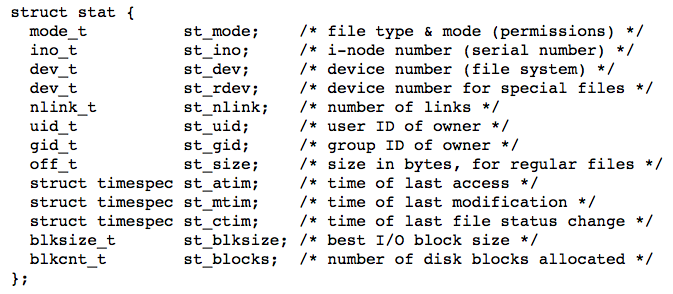

### file permission:  
> 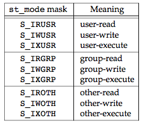

### 1. `access` and `faccessat`

> the kernel performs its access tests based on the `effective` user and group IDs.

```c
#include <unistd.h>
int access(const char *pathname, int mode);
int faccessat(int fd, const char *pathname, int mode, int flag);
// Both return: 0 if OK, −1 on error
```
> The access and faccessat functions base their tests on the real user and group IDs

### 2. `umask`
```c
#include <sys/stat.h>
mode_t umask(mode_t cmask);
// Returns: previous file mode creation mask
```

- example
```c
#include "apue.h"
#include <fcntl.h>
#define RWRWRW (S_IRUSR|S_IWUSR|S_IRGRP|S_IWGRP|S_IROTH|S_IWOTH)

int main(void)
{
    umask(0);
    if (creat("foo", RWRWRW) < 0)
        err_sys("creat error for foo");
    umask(S_IRGRP | S_IWGRP | S_IROTH | S_IWOTH);
    if (creat("bar", RWRWRW) < 0)
        err_sys("creat error for bar");
    exit(0);
}
/*
the final file permission is formatted by the bit operation(RWRWRW - umask)
*/
```

- shell command `umask`

    1. `umask`:   show current shell file mode creation mask
    2. `umask mode`: set current shell file mode creation mask
    3. `umask -S`: show current shell file mode creation mask in `symbolic form`

### 3. `chmod`, `fchmod` and `fchmodat`
```c
#include <sys/stat.h>
int chmod(const char *pathname, mode_t mode);
int fchmod(int fd, mode_t mode);
int fchmodat(int fd, const char *pathname, mode_t mode, int flag);
```

- To change the permission bits of a file, the effective user ID of the process must be equal to the owner ID of the file, or the process must have superuser permissions.
- The mode is specified as the bitwise OR of the constants shown in figure:

    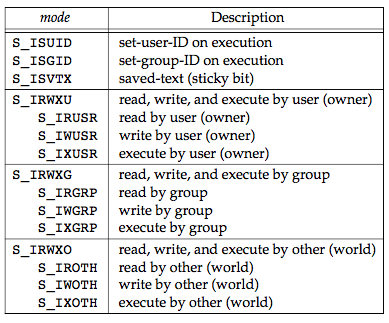

### 4. File Truncation

```c
#include <unistd.h>
int truncate(const char *pathname, off_t length); 
int ftruncate(int fd, off_t length);

```
- if the previous size was less than length, the file size will increase and the data between the old end of file and the new end of file will read as 0 (i.e., a hole is probably created in the file).


*TODO* not understood!


### 11. `ioctl` Function

```c
#include <unistd.h>  /* System V */
#include <sys/ioctl.h>  /* BSD and Linux */

int ioctl(int fd, int request, ...);
```


### 12. File System

```c
#include <unistd.h>

int link(const char *existingpath, const char *newpath);
int linkat(int efd, const char *existingpath, int nfd, const char *newpath, int flag);

int unlink(const char *pathname);
int unlinkat(int fd, const char *pathname, int flag);
```

1. every file is identified by _inode number_

2. hard link

    has the same inode numebr

3. symbolic link

    the link file's content is the linked file's mame(path)

    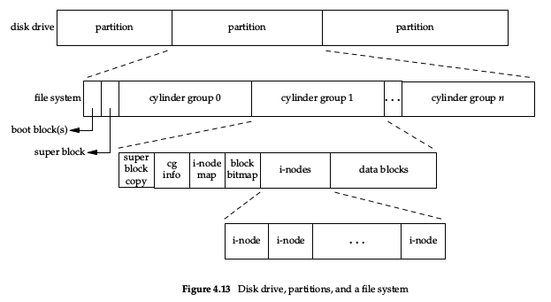
    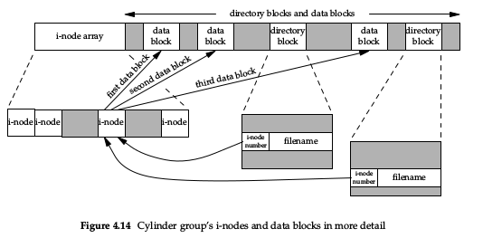

4. rename a file

    add a new dirctory entry that points to the existing inode (namely have the same inode number) and then _unlink_ the old directory entry.

5. delet a file

    as long as some process has the file open, its contents will not be deleted. When a file is closed, the kernel first checks the count of the number of processes that have the file open. If this count has reached 0, the kernel then checks the link count; if it is 0, the file’s contents are deleted.

    - process creates a file using either open or creat and then immediately calls unlink. The file is not deleted, however, because it is still open. Only when the process either closes the file or terminates, which causes the kernel to close all its open files, is the file deleted.
    - We can also unlink a file or a directory with the `remove` function. For a file, remove is identical to unlink. For a directory, remove is identical to `rmdir`.

    ```c
    #include <stdio.h>
    int remove(const char *pathname);
    ```

# Chap 5. Standard I/O Library

- When we open or create a file with the standard I/O library, we say that we have associated a stream with the file.

- the standard I/O library does not buffer the characters
- for the concept of `FILE` structure pls refer to Page 144

- ISO C I/O characteristics:
    - Stantard input and output are fully buffered if and only if they do not refer to an interactive device.
    - Standard error is never fully buffered.

### Buffer
```c
#include <stdio.h>
void setbuf(FILE *restrict fp, char *restrict buf );
int setvbuf(FILE *restrict fp, char *restrict buf, int mode,
size_t size);
```

- to disable buffering, set `buf` to `NULL`.
- the size of `buf` in function `setbuf` must be `BUFSIZE`, a constant defined in `<stdio.h>`.
- `setvbuf`: specify which type of buffering with the `mode` argument:
    - `_IOFBF` fully buffered
    - `_IOLBF` line bufferd
    - `_IONBF` unbuffered
- if we specify buffer mode as fully buffered or line buffered, and the `buf` is `NULL`, the standard I/O library will automatically allocate its own buffer of the appropriate size for the stream.

    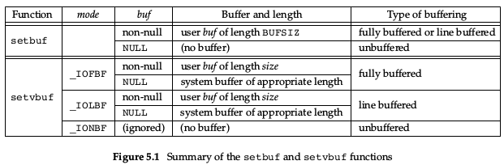

- force a stream to be flushed

    ```c
    #include <stdio.h>
    int fflush(FILE *fp);
    ```
    if `fp` is NULL, `fflush` causes all output streams to be flushed.

- open a stream

    ```c
    #include <stdio.h>
    FILE *fopen(const char *restrict pathname, const char *restrict type);
    FILE *freopen(const char *restrict pathname, const char *restrict type,
    FILE *restrict fp);
    FILE *fdopen(int fd, const char *type);
    ```

    - By default, the stream that is opened is fully buffered, unless it refers to a terminal device, in which case it is line buffered.
    - close an opened stream

        ```c
        #include <stdio.h>
        int fclose(FILE *fp);
        ```
        Any buffered output data is flushed before the file is closed. Any input data that may be buffered is discarded.

    - input functions

        ```c
        #include <stdio.h>
        int getc(FILE *fp);
        int fgetc(FILE *fp);
        int getchar(void);

        #include <stdio.h>
        char *fgets(char *restrict buf, int n, FILE *restrict fp);
        char *gets(char *buf );
        ```
        1. `getchar` is equivalent to getc(stdin).
        2. These three functions return the next character as an unsigned char converted to an int.

    - check error occurred or the end of file has been encountered.

        ```c
        #include <stdio.h>
        int ferror(FILE *fp);
        int feof(FILE *fp);
        // Both return: nonzero (true) if condition is true, 0 (false) otherwise
        void clearerr(FILE *fp);
        ```
        two flags are maintained for each stream in the `FILE` object:
        - an error flag
        - an end-of-file flag  
        both flag are cleared by calling `clearerr`
        
    - output functions

        ```c
        #include <stdio.h>
        int putc(int c, FILE *fp);
        int fputc(int c, FILE *fp);
        int putchar(int c);
        ```

- Binary I/O

    ```c
    #include <stdio.h>
    size_t fread(void *restrict ptr, size_t size, size_t nobj, FILE *restrict fp);

    size_t fwrite(const void *restrict ptr, size_t size, size_t nobj, FILE *restrict fp);
    // Both return: number of objects read or written
    ```

- postion a stream

    ```c
    #include <stdio.h>
    long ftell(FILE *fp);
    // Returns: current file position indicator if OK, −1L on error
    int fseek(FILE *fp, long offset, int whence);
    // Returns: 0 if OK, −1 on error
    void rewind(FILE *fp);
    ```
    - for a binary file, postion indicator is measured in bytes from the beginning of the file

- Formatted I/O

    ```c
    #include <stdio.h>
    int printf(const char *restrict format, ...);
    int fprintf(FILE *restrict fp, const char *restrict format, ...);
    int dprintf(int fd, const char *restrict format, ...);
    // All three return: number of characters output if OK, negative value if output error
    int sprintf(char *restrict buf, const char *restrict format, ...);
    // Returns: number of characters stored in array if OK, negative value if encoding error
    int snprintf(char *restrict buf, size_t n, const char *restrict format, ...);
    // Returns: number of characters that would have been stored in array if buffer was large enough, negative value if encoding error
    ```

    - `printf`: write to the standard output
    - `fprintf`: write to the specified stream
    - `dprintf`: write to the specified file descriptor
    - `sprintf`: palce the formatted characters in the array `buf`, and automatically append a null byte at the end of the array.
    - `snprintf`: a more secure version of `sprintf`. truncate the characters if its length exceed the size of `buf`

    - conversion syntax

        `$[flags][fldwidth][precision][lenmodifier]convtype`

        check the details in Page. 160

> the standard I/O library ends up calling the I/O routines that described in Chapter 3. Each Stantard I/O stream has an associated file descriptor. Obtain the descriptor for a stream by calling `fileno`
-
    ```c
    #include <stdio.h>
    int fileno(FILE *fp);
    ```

- Temporary files and directories

    ```c
    #include <stdio.h>
    char *tmpnam(char *ptr);

    FILE *tmpfile(void);
    ```
    - `tmpnam` create a tmp filename which does not match any existing file's name.

    - `tmpfile` creates a temporary binary file (type wb+) that is automatically removed when it is closed or on program termination.
    
    ```c
    #include <stdlib.h>
    char *mkdtemp(char *template);
    int mkstemp(char *template);
    ```
    - Unlike `tmpfile`, the temporary file created by `mkstemp` is not removed
    automatically for us.

- Memory Streams

    Memory streams have no underlying files, although they are accessed with `FILE` pointers.
    - create memory stream
        ```c
        #include <stdio.h>
        FILE *fmemopen(void *restrict buf, size_t size, const char *restrict type);
        ```

        if the `buf` is null, then the `fmemopen` allocates a buffer of `size` bytes.

    - whenever a memory stream is opened for append, the current file position is set to the first null byte in the buffer
    - The size of the stream’s contents is determined by how much we write to it.
        > see programe Figure 5.15

# Chap 6. System Data Files and Information

## Password File

- file path: `/etc/passwd`
- place holder for password
    - second
- name of the executable program to be used as the login shell for user
    - last
    - `/bin/false`, `/bin/true`, `/bin/nologin`, `/dev/null` used to prevent a particular user from logging into a system
- `nobody` user can be used to allow people login with no privileges.

```c
#include <pwd.h>
struct passwd *getpwuid(uid_t uid);
struct passwd *getpwnam(const char *name);
```
> return a pointer to a passwd structure that the functions fill in. the returned structure is usually a static variable within the function.

## Group File

- file path: `/etc/group`
- group structure

    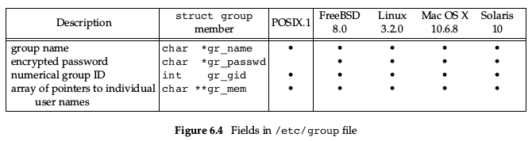

    ```c
    #include <grp.h>
    struct group *getgrgid(gid_t gid);
    struct group *getgrnam(const char *name);
    ```
    ```c
    #include <unistd.h>
    int getgroups(int gidsetsize, gid_t grouplist[]);
    // Returns: number of supplementary group IDs if OK, −1 on error

    #include <grp.h> /* on Linux */
    #include <unistd.h> /* on FreeBSD, Mac OS X, and Solaris */
    int setgroups(int ngroups, const gid_t grouplist[]);

    #include <grp.h> /* on Linux and Solaris */
    #include <unistd.h> /* on FreeBSD and Mac OS X */
    int initgroups(const char *username, gid_t basegid);
    ```
    - `getgroups`: get all the groups which current process uidz belongs to 
    - system data files and respectively set/get functions

        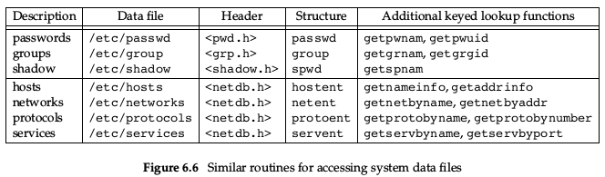

## Login Accounting

> Two data files provided with most UNIX systems are the **_utmp_** file, which keeps track of all the users currently logged in, and the **_wtmp_** file, which keeps track of all logins and logouts.
- file path: `/var/log/wtmp` and `/var/run/utmp`

## System Identification

```c
#include <sys/utsname.h>
int uname(struct utsname *name);
```

```c
struct utsname {
    char sysname[]; /* name of the operating system */
    char nodename[]; /* name of this node */
    char releasep[]; /* current release of operating system */
    char version[];
    char machine[]; /* name of hardware type */
};
```
```c
#include <unistd.h>
int gethostname(char *name, int namelen);
```

## Time and Date Routines

```c
#include <time.h>
time_t time(time_t *calptr);
```
- The time value is always returned as the value of the function. If the argument is non-null, the time value is also stored at the location pointed to by `calptr`.
- these seconds are represented in a `time_t` data type, and we call them **_calendar times_**.
- two functions `localtime` and `gmtime` convert a calendar time into what's called a broken-down time, a `tm` structure.

    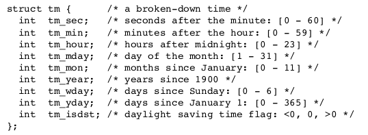

- `printf-`like function for time values.
    ```c
    #include <time.h>
    size_t strftime(char *restrict buf, size_t maxsize,
    const char *restrict format,
    const struct tm *restrict tmptr);
    size_t strftime_l(char *restrict buf, size_t maxsize,
    const char *restrict format,
    const struct tm *restrict tmptr, locale_t locale);
    ```
    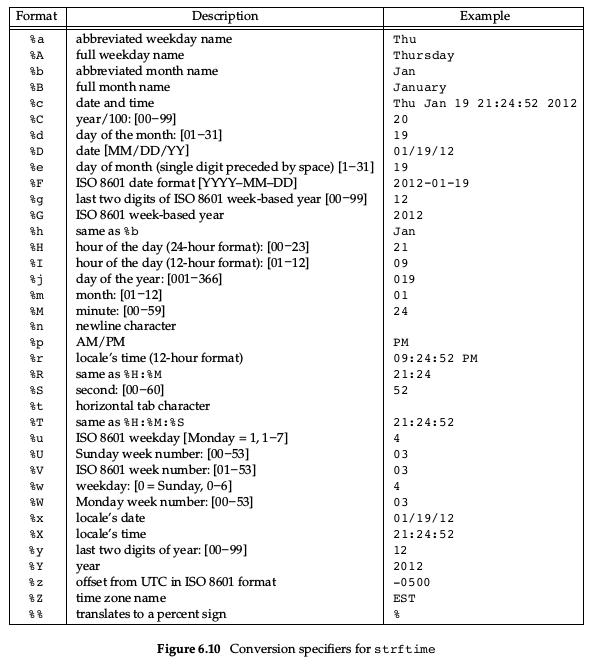


# Chap 7. Process Environment

## `main` Function

```c
int main(int argc, char *argv[]);
```
`argc` is the number of command line arguments, and `argv` is an array of pointers to the arguments.

## Process Termination

- nomal termination

    1. return from `main`
    2. calling `exit`
    3. calling `_exit` or `_Exit`
    4. return of the last thread from its start routine
    5. calling `pthread_exit` from the last thread

- abnormal termination

    1. calling `abort`
    2. receipt of a siginal
    3. response of the last thread to a cancellation request

## Exit Function
```c
#include <stdlib.h>
void exit(int status);
void _Exit(int status);
#include <unistd.h>
void _exit(int status);
```
- `_exit` and `_Exit` return to the kernel immediately, and `exit` will perform certain cleanup processing before returning to the kernel.
- `atexit` Function
    ```c
    #include <stdlib.h>
    int atexit(void (*func)(void));
    ```
    - registrer function which will be called when process exits.
    - Each function is called as many times as it was registered.

        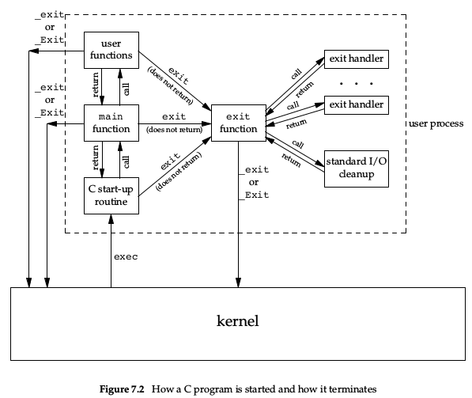

    - The only way a program can be executed by the kernel is if one of the exec functions is called.

## Environment List

> Each program is passed an environment list. the list is an array of character pointers. the address of the list is contained in the global variable `environ`:

```c
extern char **environ;
```

## Memory Layout of a C Program

- C program is composed of the following pieces:
    1. Text segment 文本段  

        read-only, sharable
    2. Initialized data segment (初始)数据段

        declaration appearing outside any function causes this variable to be stored in the initialized data segment with its initial value.

    3. Uninitialized data segment(bss) 未初始化数据段

        - data in this segment is initialized by kernel to 0 or null pointers.
        - declaration appearing outside any function without initialization cause the varible to be stored in the uninitialized data segment.

    4. Stack 栈

        section where all automatic variables are stored

    5. heap 堆

        where dynamic memory allocation usually takes place

    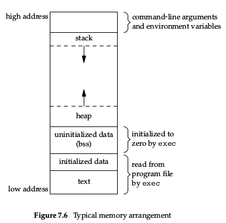

## shared library

```shell
gcc -static hello.c  # prevent gcc from using shared libraries
```

## Memory Allocation

```c
#include <stdlib.h>
void *malloc(size_t size);
void *calloc(size_t nobj, size_t size);
void *realloc(void *ptr, size_t newsize);
// All three return: non-null pointer if OK, NULL on error

void free(void *ptr);
```

1. `malloc`, initial value of the allocated memory is indeterminate.
2. `calloc`, the value of the allocated memory is initialized to all 0 bits.
3. `realloc`, it may involve moving the previously allocated area somewhere else, to provide the additional room at the end(**_If there is room beyond the end of the existing region for the requested space, then realloc simply allocates this additional area at the end and returns the same pointer that we passed it._**). Also,  when the size increases, the initial value of the space between the old contents and the end of the new area is indeterminate.

## Envirionment Variables

```c
#include <stdlib.h>
char *getenv(const char *name);
// Returns: pointer to value associated with name, NULL if not found
```

``` c
#include <stdlib.h>
int putenv(char *str);
// Returns: 0 if OK, nonzero on error

int setenv(const char *name, const char *value, int rewrite);
int unsetenv(const char *name);
// Both return: 0 if OK, −1 on error
```

- the environment list is an array of pointers to the actual _`name=value`_ strings, and the strings are typically stored at the top of a process's memory space.

## `setjmp` and `longjmp` Functions

```c
#include <setjmp.h>
int setjmp(jmp_buf env);
// Returns: 0 if called directly, nonzero if returning from a call to longjmp

void longjmp(jmp_buf env, int val);
```

- branch back through the call frames to a function that is in the call path of the current function.
- the _`val`_ in `longjmp` is a nonzero value that becomes the return  value from `setjmp`.


## `getrlimit` and `setrlimit` Functions

- query and set resource limit

```c
#include <sys/resource.h>
int getrlimit(int resource, struct rlimit *rlptr);
int setrlimit(int resource, const struct rlimit *rlptr);
```


# Chapter 9. Process Control

- Get identifiers for process

    ```c
    #include <unistd.h>

    pid_t getpid(void);
    //Returns: process ID of calling process

    pid_t getppid(void);
    //Returns: parent process ID of calling process

    uid_t getuid(void);
    //Returns: real user ID of calling process

    uid_t geteuid(void);
    //Returns: effective user ID of calling process

    gid_t getgid(void);
    //Returns: real group ID of calling process
    
    gid_t getegid(void);
    //Returns: effective group ID of calling process
    ```

    [the_difference_between_real_user_id_and_effective_user_id](https://intelligea.wordpress.com/2014/02/11/effective-user-id-and-group-id-vs-real-user-id-and-group-id/)

## _`fork`_ Function
```c
#include <unistd.h>
pid_t fork(void);
//Returns: 0 in child, process ID of child in parent, −1 on error
```

- the child gets a copy of the parent's data space, heap and stack, share the text segment


- File Sharing

    - when the standard output in parent process is redirected, the child's standard output is also redirected.
    - all file descriptors that are open in the parent are duplicated in the child.

- properties of the parent inherited by the child:
    - Real user ID, real group ID, effective user ID, and effective group ID
    - Supplementary group IDs
    - Process group ID
    - Session ID
    - Controlling terminal
    - The set-user-ID and set-group-ID flags
    - Current working directory
    - Root directory
    - File mode creation mask
    - Signal mask and dispositions
    - The close-on-exec flag for any open file descriptors
    - Environment
    - Attached shared memory segments
    - Memory mappings
    - Resource limits

- The differences between the parent and child:
    - The return values from fork are different.
    - The process IDs are different.
    - The two processes have different parent process IDs: the parent process ID of the child is the parent; the parent process ID of the parent doesn’t change.
    - The child’s tms_utime, tms_stime, tms_cutime, and tms_cstime values are set to 0 (these times are discussed in Section 8.17).
    - File locks set by the parent are not inherited by the child.
    - Pending alarms are cleared for the child.
    - The set of pending signals for the child is set to the empty set.

## `vfork`

- The vfork function was intended to create a new process for the purpose of executing a new program
- vfork guarantees that the child runs first, until the child calls `exec` or `exit`.
- the child runs in the address space of the parent until it calls either exec or exit.

## `exit`

- call `_exit` or `_Exit` to terminate a process without running exit handlers or signal handlers
- abnormal termination:
    -  calling `abort`: generate the `SIGABRT` signal.
    -  When the process receives certain signals
    -  The last thread responds to a cancellation request

> Regardless of how a process terminates, the same code in the kernel is eventually executed. This kernel code closes all the open descriptors for the process, releases the memory that it was using, and so on.

- the way inform parent process how the child terminated:
    - for `exit`s, passing an exit status
    - for abnormal termination, the kernel—not the process—generates a termination status to indicate the reason for the abnormal termination.
    - In any case, the parent of the process can obtain the termination status from either the wait or the waitpid function

- if the parent terminates before the child, the `init` process becomes the parent process of any process whose parent terminates. whenever a process terminates, the kernel goes through all active processes to see whether the terminating process is the parent of any process that still exists.
- The kernel keeps a small amount of information for every terminating process, so that the information is available when the parent of the terminating process calls `wait` or `waitpid`.
    > this information consists of the process ID, the termination status of the process, and the amount of CPU time taken by the process

- _`zombie process`_: a process that has terminated, but whose parent has not yet waited for it, is called a zombie.

## _`wait`_ and _`waitpid`_ Functions

```c
#include <sys/wait.h>
pid_t wait(int *statloc);
pid_t waitpid(pid_t pid, int *statloc, int options);
//   Both return: process ID if OK, 0 (see later), or −1 on error
```

- when a precess terminates(either normally or abnormally), the kernel notifies the parent by sending _`SIGCHLD`_ signal to the parent.
- `wait` will return immediately with an erro if it dosen't have any child processes.
- If a child has already terminated and is a zombie, `wait` returns immediately with that child’s status.
- if _`statloc`_ is not null, the termination status of the terminated process is stored in the location pointed by the argument. certain bits indicate the exit status, others indicate the signal number, and so on.
- _`waitpid`_
    - `pid==-1`, wait for any child process
    - `pid>0`, wait for the specified process
    - `pid==0`, Waits for any child whose process group ID equals that of the calling process.
    - `pid<-1`, Waits for any child whose process group ID equals the absolute value of pid.

- the _`options`_ argument for _`waitpid`_:
    - `WCONTINUED`
    - `WNOHANG`
    - `WUNTRACED`

> If we want to write a
process so that it forks a child but we don’t want to wait for the child to complete and we don’t want the child to become a zombie until we terminate, the trick is to call _**`fork twice`**_.

## _`exec`_ Functions

> When a process calls one of the exec functions, that process is completely replaced by the new program, and the new program starts executing at its main function. _**The process ID does not change across an exec, because a new process is not created; exec merely replaces the current process — its text, data, heap, and stack segments — with a brand-new program from disk.**_ 

```c
#include <unistd.h>
int execl(const char *pathname, const char *arg0, ... /* (char *)0 */ );
int execv(const char *pathname, char *const argv[]);
int execle(const char *pathname, const char *arg0, ... /* (char *)0, char *const envp[] */ );
int execve(const char *pathname, char *const argv[], char *const envp[]);
int execlp(const char *filename, const char *arg0, ... /* (char *)0 */ );
int execvp(const char *filename, char *const argv[]);
int fexecve(int fd, char *const argv[], char *const envp[]);
```

> If filename contains a slash, it is taken as a pathname, otherwise, the executable file is searched for in the directories specified by the _`PATH`_ environment variable

- if the file ins't machine executable, the functions assume that file is a shell script adn tries to invoke `/bin/sh` with the filename as input to the shell.
- If this null pointer is specified by the constant 0, we must cast it to a pointer; if we don’t, it’s interpreted as an integer argument. (for the executable file in `exec` function)

    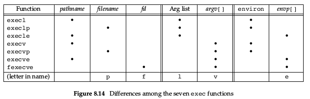

- the first argument in arglist is the executable file name.


## suid, effective-uid, read-uid

[link](https://blog.csdn.net/fmeng23/article/details/23115989)

## Interpreter Files(scripts)

- begin with a line of the form

    ```
    #! pathname [ optional-argument ]
    ```

- the pathname is recognized by the kernel as part of processsing the `exec` system call.

## _`system`_ function

```c
#include <stdlib.h>
int system(const char *cmdstring);
```

- _`system`_ is implemented by calling fork, exec, and waitpid


## Set-User-ID Programs

// TODO