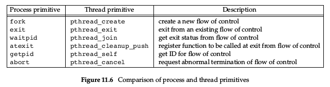

# Chap 3. File I/O

### 1. File descriptor  

> UNIX System shells associate file descriptor 0 with the standard input of a process, file descriptor 1 with the standard output, and file descriptor 2 with the standard error.

`STDIN_FILENO/0`, `STDOUT_FILENO/1`, `STDERR_FILENO/2`

### 2. `open` and `openat` Functions

```C
#include <fcntl.h>
int open(const char *path, int oflag, ... /* mode_t mode */ );
int openat(int fd, const char *path, int oflag, ... /* mode_t mode */ );
```

`oflag`:  
> 1. `O_CREAT`   
> Create the file if it doesn’t exist. This option requires a third argument to the open function (a fourth argument to the openat function) — the mode, which specifies the access permission bits of the new file.
> 2. `O_TRUNC`  
> If the file exists and if it is successfully opened for either write-only or read–write, truncate its length to 0.

Quotes
1. > `The file descriptor returned by open and openat is guaranteed to be the lowest- numbered unused descriptor.`  
2. > `The openat function is one of a class of functions added to the latest version of POSIX.1 to address two problems. First, it gives threads a way to use relative pathnames to open files in directories other than the current working directory.`

### 3. `creat` Fuction
```c
#include <fcntl.h>
int creat(const char *path, mode_t mode);
```

1. This fuction is equivalent to
    ```c 
    open(path, O_WRONLY | O_CREAT | O_TRUNC, mode);
    ```

2. When a process terminates, all of its open files are closed automatically by the kernel.

### 4. `lseek` Function
```c
#include <unistd.h>
off_t lseek(int fd, off_t offset, int whence);

// explictly set an opened file's offset
```
1. `whence` could be `SEEK_SET`, `SEEK_CUR`, `SEEK_END`
2. The file’s offset can be greater than the file’s current size, in which case the next write to the file will extend the file. _<red>This is referred to as creating a hole in a file and is allowed. Any bytes in a file that have not been written are read back as 0.</red>_

### 5. `read` Function
```c
#include <unistd.h>
ssize_t read(int fd, void *buf, size_t nbytes);

// Returns: number of bytes read, 0 if end of file, −1 on error
```
 1. several cases in which the number of bytes actually read is less than the amount requested
    > 1. When reading from a regular file, if the end of file is reached before the requested number of bytes has been read. For example, if 30 bytes remain until the end of file and we try to read 100 bytes, read returns 30. The next time we call read, it will return 0 (end of file).
    > 2. _more cases can be found in apue page 37._

 2. The read operation starts at the file’s current offset. Before a successful return, the offset is incremented by the number of bytes actually read.

### 6. `write` Function
```c
#include <unistd.h>
ssize_t write(int fd, const void *buf, size_t nbytes);

// Returns: number of bytes written if OK, −1 on error
```

> For a regular file, the write operation starts at the file’s current offset. If the O_APPEND option was specified when the file was opened, the file’s offset is set to the current end of file before each write operation. After a successful write, the file’s offset is incremented by the number of bytes actually written.

### 7. File Sharing

> Note the difference in scope between the file descriptor flags and the file status flags. The former apply only to a single descriptor in a single process, whereas the latter apply to all descriptors in any process that point to the given file table entry.

### 8. Atomic Operations
```c
#include <unistd.h>
ssize_t pread(int fd, void *buf, size_t nbytes, off_t offset);
//Returns: number of bytes read, 0 if end of file, −1 on error

ssize_t pwrite(int fd, const void *buf, size_t nbytes, off_t offset);
// Returns: number of bytes written if OK, −1 on error
```
 > equivalent to calling lseek followed by a call to read, with the following exceptions:  
> - There is no way to interrupt the two operations that occur when we call pread.
> - The current file offset is not updated.

### 9. `sync`, `fsync` and `fdatasync` Function
```c
#include <unistd.h> 
int fsync(int fd);
int fdatasync(int fd);
void sync(void);
// Returns: 0 if OK, −1 on error
```

When write data to a file, the data is normally copied by the kernel into one of its buffers and **_queued for writing_** to disk at some later time.
> - The `sync` function simply queues all the modified block buffers for writing and returns; _it does not wait for the disk writes to take place_.
> > The function sync is normally called periodically (usually every 30 seconds) from a system daemon, often called update. This guarantees regular flushing of the kernel’s block buffers.
> - The function `fsync` refers only to a single file, specified by the file descriptor fd, and _waits for the disk writes to complete before returning_.
> - The `fdatasync` function is similar to fsync, but it affects only the data portions of a file. With fsync, the file’s attributes are also updated synchronously.

### 10. `fcntl` Function

change the properties of a file that is _already open_.
```c
#include <fcntl.h>
int fcntl(int fd, int cmd, ... /* int arg */ );

// Returns: depends on cmd if OK (see following), −1 on error 
```

the cmd values:
> - `F_GETFD`
> - `F_SETFD`
> > get/set the file *descriptor flags* for fd
> - `F_GETFL`
> - `F_SETFL`
> > set/get the file status flags for fd
> > the file status flag is explained as
> > > <center></center>
> - `F_GETOWN`
> - `F_SETOWN`
> > set/get the process ID or process group ID currently receiving the SIGIO and SIGURG signals

# Chap 4. File and Directories

### file stat
> 

### file permission:  
> 

### 1. `access` and `faccessat`

> the kernel performs its access tests based on the `effective` user and group IDs.

```c
#include <unistd.h>
int access(const char *pathname, int mode);
int faccessat(int fd, const char *pathname, int mode, int flag);
// Both return: 0 if OK, −1 on error
```
> The access and faccessat functions base their tests on the real user and group IDs

### 2. `umask`
```c
#include <sys/stat.h>
mode_t umask(mode_t cmask);
// Returns: previous file mode creation mask
```

- example
```c
#include "apue.h"
#include <fcntl.h>
#define RWRWRW (S_IRUSR|S_IWUSR|S_IRGRP|S_IWGRP|S_IROTH|S_IWOTH)

int main(void)
{
    umask(0);
    if (creat("foo", RWRWRW) < 0)
        err_sys("creat error for foo");
    umask(S_IRGRP | S_IWGRP | S_IROTH | S_IWOTH);
    if (creat("bar", RWRWRW) < 0)
        err_sys("creat error for bar");
    exit(0);
}
/*
the final file permission is formatted by the bit operation(RWRWRW - umask)
*/
```

- shell command `umask`

    1. `umask`:   show current shell file mode creation mask
    2. `umask mode`: set current shell file mode creation mask
    3. `umask -S`: show current shell file mode creation mask in `symbolic form`

### 3. `chmod`, `fchmod` and `fchmodat`
```c
#include <sys/stat.h>
int chmod(const char *pathname, mode_t mode);
int fchmod(int fd, mode_t mode);
int fchmodat(int fd, const char *pathname, mode_t mode, int flag);
```

- To change the permission bits of a file, the effective user ID of the process must be equal to the owner ID of the file, or the process must have superuser permissions.
- The mode is specified as the bitwise OR of the constants shown in figure:

    

### 4. File Truncation

```c
#include <unistd.h>
int truncate(const char *pathname, off_t length); 
int ftruncate(int fd, off_t length);

```
- if the previous size was less than length, the file size will increase and the data between the old end of file and the new end of file will read as 0 (i.e., a hole is probably created in the file).


*TODO* not understood!


### 11. `ioctl` Function

```c
#include <unistd.h>  /* System V */
#include <sys/ioctl.h>  /* BSD and Linux */

int ioctl(int fd, int request, ...);
```


### 12. File System

```c
#include <unistd.h>

int link(const char *existingpath, const char *newpath);
int linkat(int efd, const char *existingpath, int nfd, const char *newpath, int flag);

int unlink(const char *pathname);
int unlinkat(int fd, const char *pathname, int flag);
```

1. every file is identified by _inode number_

2. hard link

    has the same inode numebr

3. symbolic link

    the link file's content is the linked file's mame(path)

    
    

4. rename a file

    add a new dirctory entry that points to the existing inode (namely have the same inode number) and then _unlink_ the old directory entry.

5. delet a file

    as long as some process has the file open, its contents will not be deleted. When a file is closed, the kernel first checks the count of the number of processes that have the file open. If this count has reached 0, the kernel then checks the link count; if it is 0, the file’s contents are deleted.

    - process creates a file using either open or creat and then immediately calls unlink. The file is not deleted, however, because it is still open. Only when the process either closes the file or terminates, which causes the kernel to close all its open files, is the file deleted.
    - We can also unlink a file or a directory with the `remove` function. For a file, remove is identical to unlink. For a directory, remove is identical to `rmdir`.

    ```c
    #include <stdio.h>
    int remove(const char *pathname);
    ```

# Chap 5. Standard I/O Library

- When we open or create a file with the standard I/O library, we say that we have associated a stream with the file.

- the standard I/O library does not buffer the characters
- for the concept of `FILE` structure pls refer to Page 144

- ISO C I/O characteristics:
    - Stantard input and output are fully buffered if and only if they do not refer to an interactive device.
    - Standard error is never fully buffered.

### Buffer
```c
#include <stdio.h>
void setbuf(FILE *restrict fp, char *restrict buf );
int setvbuf(FILE *restrict fp, char *restrict buf, int mode,
size_t size);
```

- to disable buffering, set `buf` to `NULL`.
- the size of `buf` in function `setbuf` must be `BUFSIZE`, a constant defined in `<stdio.h>`.
- `setvbuf`: specify which type of buffering with the `mode` argument:
    - `_IOFBF` fully buffered
    - `_IOLBF` line bufferd
    - `_IONBF` unbuffered
- if we specify buffer mode as fully buffered or line buffered, and the `buf` is `NULL`, the standard I/O library will automatically allocate its own buffer of the appropriate size for the stream.

    

- force a stream to be flushed

    ```c
    #include <stdio.h>
    int fflush(FILE *fp);
    ```
    if `fp` is NULL, `fflush` causes all output streams to be flushed.

- open a stream

    ```c
    #include <stdio.h>
    FILE *fopen(const char *restrict pathname, const char *restrict type);
    FILE *freopen(const char *restrict pathname, const char *restrict type,
    FILE *restrict fp);
    FILE *fdopen(int fd, const char *type);
    ```

    - By default, the stream that is opened is fully buffered, unless it refers to a terminal device, in which case it is line buffered.
    - close an opened stream

        ```c
        #include <stdio.h>
        int fclose(FILE *fp);
        ```
        Any buffered output data is flushed before the file is closed. Any input data that may be buffered is discarded.

    - input functions

        ```c
        #include <stdio.h>
        int getc(FILE *fp);
        int fgetc(FILE *fp);
        int getchar(void);

        #include <stdio.h>
        char *fgets(char *restrict buf, int n, FILE *restrict fp);
        char *gets(char *buf );
        ```
        1. `getchar` is equivalent to getc(stdin).
        2. These three functions return the next character as an unsigned char converted to an int.

    - check error occurred or the end of file has been encountered.

        ```c
        #include <stdio.h>
        int ferror(FILE *fp);
        int feof(FILE *fp);
        // Both return: nonzero (true) if condition is true, 0 (false) otherwise
        void clearerr(FILE *fp);
        ```
        two flags are maintained for each stream in the `FILE` object:
        - an error flag
        - an end-of-file flag  
        both flag are cleared by calling `clearerr`
        
    - output functions

        ```c
        #include <stdio.h>
        int putc(int c, FILE *fp);
        int fputc(int c, FILE *fp);
        int putchar(int c);
        ```

- Binary I/O

    ```c
    #include <stdio.h>
    size_t fread(void *restrict ptr, size_t size, size_t nobj, FILE *restrict fp);

    size_t fwrite(const void *restrict ptr, size_t size, size_t nobj, FILE *restrict fp);
    // Both return: number of objects read or written
    ```

- postion a stream

    ```c
    #include <stdio.h>
    long ftell(FILE *fp);
    // Returns: current file position indicator if OK, −1L on error
    int fseek(FILE *fp, long offset, int whence);
    // Returns: 0 if OK, −1 on error
    void rewind(FILE *fp);
    ```
    - for a binary file, postion indicator is measured in bytes from the beginning of the file

- Formatted I/O

    ```c
    #include <stdio.h>
    int printf(const char *restrict format, ...);
    int fprintf(FILE *restrict fp, const char *restrict format, ...);
    int dprintf(int fd, const char *restrict format, ...);
    // All three return: number of characters output if OK, negative value if output error
    int sprintf(char *restrict buf, const char *restrict format, ...);
    // Returns: number of characters stored in array if OK, negative value if encoding error
    int snprintf(char *restrict buf, size_t n, const char *restrict format, ...);
    // Returns: number of characters that would have been stored in array if buffer was large enough, negative value if encoding error
    ```

    - `printf`: write to the standard output
    - `fprintf`: write to the specified stream
    - `dprintf`: write to the specified file descriptor
    - `sprintf`: palce the formatted characters in the array `buf`, and automatically append a null byte at the end of the array.
    - `snprintf`: a more secure version of `sprintf`. truncate the characters if its length exceed the size of `buf`

    - conversion syntax

        `$[flags][fldwidth][precision][lenmodifier]convtype`

        check the details in Page. 160

> the standard I/O library ends up calling the I/O routines that described in Chapter 3. Each Stantard I/O stream has an associated file descriptor. Obtain the descriptor for a stream by calling `fileno`
-
    ```c
    #include <stdio.h>
    int fileno(FILE *fp);
    ```

- Temporary files and directories

    ```c
    #include <stdio.h>
    char *tmpnam(char *ptr);

    FILE *tmpfile(void);
    ```
    - `tmpnam` create a tmp filename which does not match any existing file's name.

    - `tmpfile` creates a temporary binary file (type wb+) that is automatically removed when it is closed or on program termination.
    
    ```c
    #include <stdlib.h>
    char *mkdtemp(char *template);
    int mkstemp(char *template);
    ```
    - Unlike `tmpfile`, the temporary file created by `mkstemp` is not removed
    automatically for us.

- Memory Streams

    Memory streams have no underlying files, although they are accessed with `FILE` pointers.
    - create memory stream
        ```c
        #include <stdio.h>
        FILE *fmemopen(void *restrict buf, size_t size, const char *restrict type);
        ```

        if the `buf` is null, then the `fmemopen` allocates a buffer of `size` bytes.

    - whenever a memory stream is opened for append, the current file position is set to the first null byte in the buffer
    - The size of the stream’s contents is determined by how much we write to it.
        > see programe Figure 5.15

# Chap 6. System Data Files and Information

## Password File

- file path: `/etc/passwd`
- place holder for password
    - second
- name of the executable program to be used as the login shell for user
    - last
    - `/bin/false`, `/bin/true`, `/bin/nologin`, `/dev/null` used to prevent a particular user from logging into a system
- `nobody` user can be used to allow people login with no privileges.

```c
#include <pwd.h>
struct passwd *getpwuid(uid_t uid);
struct passwd *getpwnam(const char *name);
```
> return a pointer to a passwd structure that the functions fill in. the returned structure is usually a static variable within the function.

## Group File

- file path: `/etc/group`
- group structure

    

    ```c
    #include <grp.h>
    struct group *getgrgid(gid_t gid);
    struct group *getgrnam(const char *name);
    ```
    ```c
    #include <unistd.h>
    int getgroups(int gidsetsize, gid_t grouplist[]);
    // Returns: number of supplementary group IDs if OK, −1 on error

    #include <grp.h> /* on Linux */
    #include <unistd.h> /* on FreeBSD, Mac OS X, and Solaris */
    int setgroups(int ngroups, const gid_t grouplist[]);

    #include <grp.h> /* on Linux and Solaris */
    #include <unistd.h> /* on FreeBSD and Mac OS X */
    int initgroups(const char *username, gid_t basegid);
    ```
    - `getgroups`: get all the groups which current process uidz belongs to 
    - system data files and respectively set/get functions

        

## Login Accounting

> Two data files provided with most UNIX systems are the **_utmp_** file, which keeps track of all the users currently logged in, and the **_wtmp_** file, which keeps track of all logins and logouts.
- file path: `/var/log/wtmp` and `/var/run/utmp`

## System Identification

```c
#include <sys/utsname.h>
int uname(struct utsname *name);
```

```c
struct utsname {
    char sysname[]; /* name of the operating system */
    char nodename[]; /* name of this node */
    char releasep[]; /* current release of operating system */
    char version[];
    char machine[]; /* name of hardware type */
};
```
```c
#include <unistd.h>
int gethostname(char *name, int namelen);
```

## Time and Date Routines

```c
#include <time.h>
time_t time(time_t *calptr);
```
- The time value is always returned as the value of the function. If the argument is non-null, the time value is also stored at the location pointed to by `calptr`.
- these seconds are represented in a `time_t` data type, and we call them **_calendar times_**.
- two functions `localtime` and `gmtime` convert a calendar time into what's called a broken-down time, a `tm` structure.

    

- `printf-`like function for time values.
    ```c
    #include <time.h>
    size_t strftime(char *restrict buf, size_t maxsize,
    const char *restrict format,
    const struct tm *restrict tmptr);
    size_t strftime_l(char *restrict buf, size_t maxsize,
    const char *restrict format,
    const struct tm *restrict tmptr, locale_t locale);
    ```
    


# Chap 7. Process Environment

## `main` Function

```c
int main(int argc, char *argv[]);
```
`argc` is the number of command line arguments, and `argv` is an array of pointers to the arguments.

## Process Termination

- nomal termination

    1. return from `main`
    2. calling `exit`
    3. calling `_exit` or `_Exit`
    4. return of the last thread from its start routine
    5. calling `pthread_exit` from the last thread

- abnormal termination

    1. calling `abort`
    2. receipt of a siginal
    3. response of the last thread to a cancellation request

## Exit Function
```c
#include <stdlib.h>
void exit(int status);
void _Exit(int status);
#include <unistd.h>
void _exit(int status);
```
- `_exit` and `_Exit` return to the kernel immediately, and `exit` will perform certain cleanup processing before returning to the kernel.
- `atexit` Function
    ```c
    #include <stdlib.h>
    int atexit(void (*func)(void));
    ```
    - registrer function which will be called when process exits.
    - Each function is called as many times as it was registered.

        

    - The only way a program can be executed by the kernel is if one of the exec functions is called.

## Environment List

> Each program is passed an environment list. the list is an array of character pointers. the address of the list is contained in the global variable `environ`:

```c
extern char **environ;
```

## Memory Layout of a C Program

- C program is composed of the following pieces:
    1. Text segment 文本段  

        read-only, sharable
    2. Initialized data segment (初始)数据段

        declaration appearing outside any function causes this variable to be stored in the initialized data segment with its initial value.

    3. Uninitialized data segment(bss) 未初始化数据段

        - data in this segment is initialized by kernel to 0 or null pointers.
        - declaration appearing outside any function without initialization cause the varible to be stored in the uninitialized data segment.

    4. Stack 栈

        section where all automatic variables are stored

    5. heap 堆

        where dynamic memory allocation usually takes place

    

## shared library

```shell
gcc -static hello.c  # prevent gcc from using shared libraries
```

## Memory Allocation

```c
#include <stdlib.h>
void *malloc(size_t size);
void *calloc(size_t nobj, size_t size);
void *realloc(void *ptr, size_t newsize);
// All three return: non-null pointer if OK, NULL on error

void free(void *ptr);
```

1. `malloc`, initial value of the allocated memory is indeterminate.
2. `calloc`, the value of the allocated memory is initialized to all 0 bits.
3. `realloc`, it may involve moving the previously allocated area somewhere else, to provide the additional room at the end(**_If there is room beyond the end of the existing region for the requested space, then realloc simply allocates this additional area at the end and returns the same pointer that we passed it._**). Also,  when the size increases, the initial value of the space between the old contents and the end of the new area is indeterminate.

## Envirionment Variables

```c
#include <stdlib.h>
char *getenv(const char *name);
// Returns: pointer to value associated with name, NULL if not found
```

``` c
#include <stdlib.h>
int putenv(char *str);
// Returns: 0 if OK, nonzero on error

int setenv(const char *name, const char *value, int rewrite);
int unsetenv(const char *name);
// Both return: 0 if OK, −1 on error
```

- the environment list is an array of pointers to the actual _`name=value`_ strings, and the strings are typically stored at the top of a process's memory space.

## `setjmp` and `longjmp` Functions

```c
#include <setjmp.h>
int setjmp(jmp_buf env);
// Returns: 0 if called directly, nonzero if returning from a call to longjmp

void longjmp(jmp_buf env, int val);
```

- branch back through the call frames to a function that is in the call path of the current function.
- the _`val`_ in `longjmp` is a nonzero value that becomes the return  value from `setjmp`.


## `getrlimit` and `setrlimit` Functions

- query and set resource limit

```c
#include <sys/resource.h>
int getrlimit(int resource, struct rlimit *rlptr);
int setrlimit(int resource, const struct rlimit *rlptr);
```


# Chapter 9. Process Control

- Get identifiers for process

    ```c
    #include <unistd.h>

    pid_t getpid(void);
    //Returns: process ID of calling process

    pid_t getppid(void);
    //Returns: parent process ID of calling process

    uid_t getuid(void);
    //Returns: real user ID of calling process

    uid_t geteuid(void);
    //Returns: effective user ID of calling process

    gid_t getgid(void);
    //Returns: real group ID of calling process
    
    gid_t getegid(void);
    //Returns: effective group ID of calling process
    ```

    [the_difference_between_real_user_id_and_effective_user_id](https://intelligea.wordpress.com/2014/02/11/effective-user-id-and-group-id-vs-real-user-id-and-group-id/)

## _`fork`_ Function
```c
#include <unistd.h>
pid_t fork(void);
//Returns: 0 in child, process ID of child in parent, −1 on error
```

- the child gets a copy of the parent's data space, heap and stack, share the text segment


- File Sharing

    - when the standard output in parent process is redirected, the child's standard output is also redirected.
    - all file descriptors that are open in the parent are duplicated in the child.

- properties of the parent inherited by the child:
    - Real user ID, real group ID, effective user ID, and effective group ID
    - Supplementary group IDs
    - Process group ID
    - Session ID
    - Controlling terminal
    - The set-user-ID and set-group-ID flags
    - Current working directory
    - Root directory
    - File mode creation mask
    - Signal mask and dispositions
    - The close-on-exec flag for any open file descriptors
    - Environment
    - Attached shared memory segments
    - Memory mappings
    - Resource limits

- The differences between the parent and child:
    - The return values from fork are different.
    - The process IDs are different.
    - The two processes have different parent process IDs: the parent process ID of the child is the parent; the parent process ID of the parent doesn’t change.
    - The child’s tms_utime, tms_stime, tms_cutime, and tms_cstime values are set to 0 (these times are discussed in Section 8.17).
    - File locks set by the parent are not inherited by the child.
    - Pending alarms are cleared for the child.
    - The set of pending signals for the child is set to the empty set.

## `vfork`

- The vfork function was intended to create a new process for the purpose of executing a new program
- vfork guarantees that the child runs first, until the child calls `exec` or `exit`.
- the child runs in the address space of the parent until it calls either exec or exit.

## `exit`

- call `_exit` or `_Exit` to terminate a process without running exit handlers or signal handlers
- abnormal termination:
    -  calling `abort`: generate the `SIGABRT` signal.
    -  When the process receives certain signals
    -  The last thread responds to a cancellation request

> Regardless of how a process terminates, the same code in the kernel is eventually executed. This kernel code closes all the open descriptors for the process, releases the memory that it was using, and so on.

- the way inform parent process how the child terminated:
    - for `exit`s, passing an exit status
    - for abnormal termination, the kernel—not the process—generates a termination status to indicate the reason for the abnormal termination.
    - In any case, the parent of the process can obtain the termination status from either the wait or the waitpid function

- if the parent terminates before the child, the `init` process becomes the parent process of any process whose parent terminates. whenever a process terminates, the kernel goes through all active processes to see whether the terminating process is the parent of any process that still exists.
- The kernel keeps a small amount of information for every terminating process, so that the information is available when the parent of the terminating process calls `wait` or `waitpid`.
    > this information consists of the process ID, the termination status of the process, and the amount of CPU time taken by the process

- _`zombie process`_: a process that has terminated, but whose parent has not yet waited for it, is called a zombie.

## _`wait`_ and _`waitpid`_ Functions

```c
#include <sys/wait.h>
pid_t wait(int *statloc);
pid_t waitpid(pid_t pid, int *statloc, int options);
//   Both return: process ID if OK, 0 (see later), or −1 on error
```

- when a precess terminates(either normally or abnormally), the kernel notifies the parent by sending _`SIGCHLD`_ signal to the parent.
- `wait` will return immediately with an erro if it dosen't have any child processes.
- If a child has already terminated and is a zombie, `wait` returns immediately with that child’s status.
- if _`statloc`_ is not null, the termination status of the terminated process is stored in the location pointed by the argument. certain bits indicate the exit status, others indicate the signal number, and so on.
- _`waitpid`_
    - `pid==-1`, wait for any child process
    - `pid>0`, wait for the specified process
    - `pid==0`, Waits for any child whose process group ID equals that of the calling process.
    - `pid<-1`, Waits for any child whose process group ID equals the absolute value of pid.

- the _`options`_ argument for _`waitpid`_:
    - `WCONTINUED`
    - `WNOHANG`
    - `WUNTRACED`

> If we want to write a
process so that it forks a child but we don’t want to wait for the child to complete and we don’t want the child to become a zombie until we terminate, the trick is to call _**`fork twice`**_.

## _`exec`_ Functions

> When a process calls one of the exec functions, that process is completely replaced by the new program, and the new program starts executing at its main function. _**The process ID does not change across an exec, because a new process is not created; exec merely replaces the current process — its text, data, heap, and stack segments — with a brand-new program from disk.**_ 

```c
#include <unistd.h>
int execl(const char *pathname, const char *arg0, ... /* (char *)0 */ );
int execv(const char *pathname, char *const argv[]);
int execle(const char *pathname, const char *arg0, ... /* (char *)0, char *const envp[] */ );
int execve(const char *pathname, char *const argv[], char *const envp[]);
int execlp(const char *filename, const char *arg0, ... /* (char *)0 */ );
int execvp(const char *filename, char *const argv[]);
int fexecve(int fd, char *const argv[], char *const envp[]);
```

> If filename contains a slash, it is taken as a pathname, otherwise, the executable file is searched for in the directories specified by the _`PATH`_ environment variable

- if the file ins't machine executable, the functions assume that file is a shell script adn tries to invoke `/bin/sh` with the filename as input to the shell.
- If this null pointer is specified by the constant 0, we must cast it to a pointer; if we don’t, it’s interpreted as an integer argument. (for the executable file in `exec` function)

    

- the first argument in arglist is the executable file name.


## suid, effective-uid, read-uid

[link](https://blog.csdn.net/fmeng23/article/details/23115989)

## Interpreter Files(scripts)

- begin with a line of the form

    ```
    #! pathname [ optional-argument ]
    ```

- the pathname is recognized by the kernel as part of processsing the `exec` system call.

## _`system`_ function

```c
#include <stdlib.h>
int system(const char *cmdstring);
```

- _`system`_ is implemented by calling fork, exec, and waitpid


## Process Accounting

// TODO [not understood]

## User Identification

# Process Relationships

## Terminal Logins

- _`login`_ workflow

    

## Prcess Groups

```c
#include <unistd.h>
pid_t getpgrp(void);
// Returns: process group ID of calling process

#include <unistd.h>
pid_t getpgid(pid_t pid);
```

- Each process group can have a process group leader. The leader is identified by its process group ID being equal to its process ID.
- The process group still exists, as long as at least one process is in the group, regardless of whether the group leader terminates.
- A process joins an existing process group or creates a new process group by calling _`setpgid`_.
    ```c
    #include <unistd.h>
    int setpgid(pid_t pid, pid_t pgid);
    ``` 

## Sessions

- A session is a collection of one or more process groups.
- A process establishes a new session by calling the _`setsid`_ function.
    ```c
    #include <unistd.h>
    pid_t setsid(void);
    ```

## Controlling Terminal

TODO

# Chapter 10. Signals

## Signals

- every signal has a name, all begin with _`SIG`_.
- conditions generate signal:
    - termial-generated:
        - pressing the DELETE key or Control-C, causes the _`SIGINT`_
    - divide by 0, invalid memory reference.
    - calling the _`kill`_ function.
- _`SIGKILL`_ and _`SIGSTOP`_ can never be ignored.
- UNIX System signals
     
    - _`SIGCHLD`_: Whenever a process terminates or stops, the SIGCHLD signal is sent to the parent
    - _`SIGTERM`_: This is the termination signal sent by the _`kill`_ command by default.
    - _`SIGUSR1`_, _`SIGUSR2`_: user-defined signals

## _`signal`_ Function

```c
#include <signal.h>
void (*signal(int signo, void (*func)(int)))(int);
// Returns: previous disposition of signal (see following) if OK, SIG_ERR on error
```

- value of _`func`_:
    - _`SIG_IGN`_, ignore
    - _`SIG_DFL`_, default
    - the address of a function to be called when the signal occurs.
- The return value from _`signal`_ is the pointer to the previous signal handler.
- _`signal`_ functionn prototype can be made simpler by:
    ```c
    typedef void Sigfunc(int);

    Sigfunc *signal(int, Sigfunc *);
    ```
- macros in _`<signal.h>`_:
    ```c
    #define SIG_ERR (void (*)())-1
    #define SIG_DFL (void (*)())0
    #define SIG_IGN (void (*)())1
    ``` 
- the shell automatically sets the disposition of the interrupt and quit signals in the background process to be ignored.
- _**When a process calls fork, the child inherits the parent’s signal dispositions.**_

## Unreliable Signals

```c
int sig_int();   /* my signal handling function */
.
.
.
signal(SIGINT, sig_int) /* establish handler */
{
    signal(SIGINT, sig_int); /* reestablish handler for next time */
    .
    .
    .
}
```

> The problem with this code fragment is that there is a window of time—after the signal has occurred, but before the call to signal in the signal handler—when the interrupt signal could occur another time

## Interrupted System Calls

> A characteristic of earlier UNIX systems was that if a process caught a signal while the process was blocked in a ‘‘slow’’ system call, the system call was interrupted. The system call returned an error and errno was set to EINTR.

- The problem with interrupted system calls is that we now have to handle the error return explicitly: 
    ```c
    again: 
        if ((n = read(fd, buf, BUFFSIZE)) < 0) {
            if (errno == EINTR)
                goto again;   /* just an interrupted system call */
            /* handle other errors */
            /* can be rewriten with while statement */
        }
    ``` 

- > When a signal that is being caught is handled by a process, the normal sequence of instructions being executed by the process is temporarily interrupted by the signal handler. The process then continues executing, but the instructions in the signal handler are now executed.

## Reentrant Functions

- some function block any signals during operation if delivery of a signal might cause inconsistencies.

## _`SIGCHLD`_ Semantics

- When the signal occurs, the status of a child has changed, and we need to call one of the wait functions to determine what has happened.

- During the time between the generation of a signal and its delivery, the signal is said to be _pending_.
- the system determines what to do with a blocked signal when the signal is delivered, not when it’s generated.
- What happens if a blocked signal is generated more than once before the process unblocks the signal? the UNIX kernel simply delivers the signal once.
- Each process has a **_signal mask_** that defines the set of signals currently blocked from delivery to that process. A process can examine and change its current signal mask by calling _`sigprocmask`_.

## _`kill`_ and _`raise`_ Functions

```c
#include <signal.h>
int kill(pid_t pid, int signo);
int raise(int signo);
```

- The kill function sends a signal to a process or a group of processes.
- The raise function allows a process to send a signal to itself.
    
- a process needs permission to send a signal to another process. The superuser can send a signal to any process.
- > POSIX.1 defines signal number 0 as the null signal. If the signo argument is 0, then the normal error checking is performed by kill, but no signal is sent. This technique is often used to determine if a specific process still exists. If we send the process the null signal and it doesn’t exist, kill returns −1 and errno is set to ESRCH.

## _`alarm`_ and _`pause`_ Functions

```c
#include <unistd.h>
unsigned int alarm(unsigned int seconds);

#include <unistd.h>
int pause(void);
```
- When the timer expires, the SIGALRM signal is generated. If we ignore or don’t catch this signal, its default action is to terminate the process.
- If, when we call alarm, a previously registered alarm clock for the process has not yet expired, the number of seconds left for that alarm clock is returned as the value of this function.
- The pause function suspends the calling process until a signal is caught.

## Signal Sets

```c
#include <signal.h>
int sigemptyset(sigset_t *set);
int sigfillset(sigset_t *set);
int sigaddset(sigset_t *set, int signo);
int sigdelset(sigset_t *set, int signo);
int sigismember(const sigset_t *set, int signo);
```
- `sigemptyset` initializes the signal set pointed to by set so that all signals
are excluded.
- `sigfillset` initializes the signal set so that all signals are included.

## `Sigprocmask` Function

```c
#include <signal.h>
int sigprocmask(int how, const sigset_t *restrict set, sigset_t *restrict oset);
```
- the signal mask of a process is the set of signals currently blocked from delivery to that process
- the _`how`_ argument indicates how the current signal mask is modified
    - 
- If _`set`_ is a null pointer, the signal mask of the process is not changed, and how is ignored.

## `sigpending` Function

```c
#include <signal.h>
int sigpending(sigset_t *set);
```
- returns the set of signals that are blocked from delivery and currently pending for the calling process.

## `sigaction` Function
```c
#include <signal.h>
int sigaction(int signo, const struct sigaction *restrict act, struct sigaction *restrict oact);
```

- struct sigaction:
    ```c
    struct sigaction {
        void       (*sa_handler)(int);
        sigset_t   sa_mask;
        int        sa_flags;
        void       (*sa_sigaction)(int, siginfo_t *, void *);
    }
    ```
    - _`sa_handler`_: the address of a signal-catching function or SIG_DFL, SIG_IGN
    - _**When changing the action for a signal, the sa_mask field specifies a set of signals that are added to the signal mask of the process before the signal-catching function is called. If and when the signal-catching function returns, the signal mask of the process is reset to its previous value**_.
    - we are guaranteed that whenever we are processing a given signal, another occurrence of that same signal is blocked until we’re finished processing the first occurrence.
    - Once we install an action for a given signal, that action remains installed until we explicitly change it by calling sigaction
    - `SA_SIGINFO` in `sa_flags`: This option provides additional information to a signal handler: a pointer to a siginfo structure and a pointer to an identifier for the process context.
    - Normally, the signal handler is called as
        ```c
        void handler(int signo);
        ``` 
        but if the SA_SIGINFO flag is set, the signal handler is called as
        ```c
        void handler(int signo, siginfo_t *info, void *context);
        ``` 
    - struct `siginfo`:
        

## `sigsetjmp` and `siglongjmp` Functions

```c
#include <setjmp.h>
int sigsetjmp(sigjmp_buf env, int savemask);
void siglongjmp(sigjmp_buf env, int val);
```
- when a signal is caught, the signal-catching function is entered, with the current signal automatically being added to the signal mask of the process.
- These two functions should always be used when branching from a signal handler.
- If `savemask` is nonzero, then `sigsetjmp` also saves the current signal mask of the process in env. When siglongjmp is called, if the env argument was saved by a call to sigsetjmp with a nonzero savemask, then siglongjmp restores the saved signal mask.
- _`sig_atomic_t`_ is defined by the ISO C standard to be the type of variable that can be written without being interrupted

## `sigsuspend` Function

> a way to both restore the signal mask and put the process to sleep in a single atomic operation.
```c
#include <signal.h>
int sigsuspend(const sigset_t *sigmask);
```
- The signal mask of the process is set to the value pointed to by sigmask. Then the process is suspended until a signal is caught or until a signal occurs that terminates the process.
- If a signal is caught and if the signal handler returns, then sigsuspend returns, _and the signal mask of the process is set to its value before the call to sigsuspend_.

## `abort` Function

```c
#include <stdlib.h>
void abort(void);
```
> sends the SIGABRT signal to the caller.

- after calling `abort` and the `SIGABRT` handler, the process will terminate.

## sleep, nanosleep, and clock_nanosleep Functions
```c
#include <unistd.h>
unsigned int sleep(unsigned int seconds);
```
- cause the calling process to be suspended until either
    1. The amount of wall clock time specified by seconds has elapsed.
    2. A signal is caught by the process and the signal handler returns.

## `sigqueue` Function

## Job-Control Signals

- `SIGCHLD`, `SIGCONT`, `SIGSTOP`, `SIGTSTP`, `SIGTTIN`, `SIGTTOU`

# Chapter 11. Threads

## intro

> A thread consists of the information necessary to represent an execution context within a process. This includes a thread ID that identifies the thread within a process, a set of register values, a stack, a scheduling priority and policy, a signal mask, an errno variable (recall Section 1.7), and thread-specific data (Section 12.6)

## Thread Identification

- the thread ID has significance only within the context of the process to which it belongs.
- portable implementations can’t treat them as integers. So portable thread equality comparation:
    ```c
    #include <pthread.h>
    int pthread_equal(pthread_t tid1, pthread_t tid2);
    ``` 

- get thread self id
    ```c
    #include <pthread.h>
    pthread_t pthread_self(void);
    ``` 
## Thread Creation
```c
#include <pthread.h>
int pthread_create(pthread_t *restrict tidp, const pthread_attr_t *restrict attr, void *(*start_rtn)(void *), void *restrict arg);
```

- The newly created thread has access to the process address space and inherits the calling thread’s floating-point environment and signal mask; however, the set of pending signals for the thread is cleared.

## Thread Termination

- If any thread within a process calls exit, _Exit, or _exit, then the entire process terminates.


1. The thread can simply return from the start routine. The return value is the thread’s exit code.
2. The thread can be canceled by another thread in the same process.
3. The thread can call pthread_exit.

    ```c
    #include <pthread.h>
    void pthread_exit(void *rval_ptr);
    ```
    The `rval_ptr` argument is a typeless pointer,This pointer is available to other threads in the process by calling the `pthread_join` function.
    ```c
    #include <pthread.h> 
    int pthread_join(pthread_t thread, void **rval_ptr);
    ```
    > The calling thread will block until the specified thread calls pthread_exit, returns from its start routine, or is canceled. If the thread simply returned from its start routine, rval_ptr will contain the return code. If the thread was canceled, the memory location specified by rval_ptr is set to PTHREAD_CANCELED.

 
 ```c
#include <pthread.h> 
int pthread_cancel(pthread_t tid);
```
- A thread can arrange for functions to be called when it exits, similar to the way that the _`atexit`_ function. The handlers are recorded in a stack, which means that they are executed in the reverse order from that with which they were registered.
    ```c
    #include <pthread.h>
    void pthread_cleanup_push(void (*rtn)(void *), void *arg);
    void pthread_cleanup_pop(int execute);
    ```
- The _`pthread_cleanup_push`_ function schedules the cleanup function, rtn, to be called with the single argument, arg, when the thread performs one of the following actions:
 
    1. Makes a call to pthread_exit
    2. Responds to a cancellation request
    3. Makes a call to pthread_cleanup_pop with a nonzero execute argument

- if the thread terminates by returning from its start routine, its cleanup handlers are not called.
- 
- A Detached thread automatically releases it allocated resources on exit. No other thread needs to join it. But by default all threads are joinable
    ```c
    #include <pthread.h>
    int pthread_detach(pthread_t tid);
    ```

## Thread Synchronization

## Mutexes

> A _mutex_ is basically a lock that we set (lock) before accessing a shared resource and release (unlock) when we’re done. While it is set, any other thread that tries to set it will block until we release it.

- A mutex variable is represented by the _`pthread_mutex_t`_ data type. init mutex by
    ```c
    #include <pthread.h>
    int pthread_mutex_init(pthread_mutex_t *restrict mutex, const pthread_mutexattr_t *restrict attr);
    int pthread_mutex_destroy(pthread_mutex_t *mutex);
    ```
    lock a mutex by
    ```c
    #include <pthread.h>
    int pthread_mutex_lock(pthread_mutex_t *mutex);
    int pthread_mutex_trylock(pthread_mutex_t *mutex);
    int pthread_mutex_unlock(pthread_mutex_t *mutex);
    ```

## Deadlock Avoidance

> For example, when we use more than one mutex in our programs, a deadlock can occur if we allow one thread to hold a mutex and block while trying to lock a second mutex at the same time that another thread holding the second mutex tries to lock the first mutex.

## Reader-Writer Locks

> Only one thread at a time can hold a reader–writer lock in write mode, but multiple threads can hold a reader–writer lock in read mode at the same time.
- When a reader–writer lock is write locked, all threads attempting to lock it block until it is unlocked
- When a reader–writer lock is read locked, all threads attempting to lock it in read mode are given access, but any threads attempting to lock it in write mode block until all the threads have released their read locks.
- Reader–writer locks are well suited for situations in which data structures are read more often than they are modified
- When a reader–writer lock is read locked, it is said to be locked in shared mode. When it is write locked, it is said to be locked in exclusive mode.
- init and destroy
    ```c
    #include <pthread.h>
    int pthread_rwlock_init(pthread_rwlock_t *restrict rwlock, const pthread_rwlockattr_t *restrict attr);
    int pthread_rwlock_destroy(pthread_rwlock_t *rwlock);
    ```
    Before freeing the memory backing a reader–writer lock, we need to call pthread_rwlock_destroy to clean up the resources allocated for the lock.
- To lock a reader–writer lock in read mode, we call pthread_rwlock_rdlock. To write lock a reader–writer lock, we call pthread_rwlock_wrlock. Regardless of how we lock a reader–writer lock, we can unlock it by calling pthread_rwlock_unlock.
    ```c
    #include <pthread.h>
    int pthread_rwlock_rdlock(pthread_rwlock_t *rwlock);
    int pthread_rwlock_wrlock(pthread_rwlock_t *rwlock);
    int pthread_rwlock_unlock(pthread_rwlock_t *rwlock);

    #include <pthread.h>
    int pthread_rwlock_tryrdlock(pthread_rwlock_t *rwlock);
    int pthread_rwlock_trywrlock(pthread_rwlock_t *rwlock);
    Both return: 0 if OK, error num

    #include <pthread.h>
    #include <time.h>
    int pthread_rwlock_timedrdlock(pthread_rwlock_t *restrict rwlock, const struct timespec *restrict tsptr);
    int pthread_rwlock_timedwrlock(pthread_rwlock_t *restrict rwlock, const struct timespec *restrict tsptr);
    ``` 

## Condition Variables

- The condition itself is protected by a mutex. A thread must first lock the mutex to change the condition state.
- init and destroy
    ```c
    #include <pthread.h>
    int pthread_cond_init(pthread_cond_t *restrict cond, const pthread_condattr_t *restrict attr);
    int pthread_cond_destroy(pthread_cond_t *cond);
    ``` 
- use _`pthread_cond_wait`_ to wait for a condition to be true.
    ```c
    #include <pthread.h>
    int pthread_cond_wait(pthread_cond_t *restrict cond, pthread_mutex_t *restrict mutex);
    int pthread_cond_timedwait(pthread_cond_t *restrict cond, pthread_mutex_t *restrict mutex,
    const struct timespec *restrict tsptr);
    ``` 
    _**The mutex passed to pthread_cond_wait protects the condition. The caller passes it locked to the function, which then atomically places the calling thread on the list of threads waiting for the condition and unlocks the mutex**_.
    - When pthread_cond_wait returns, the mutex is again locked
    - When it returns from a successful call to pthread_cond_wait or pthread_cond_timedwait, **_a thread needs to reevaluate the condition, since another thread might have run and already changed the condition_**.
- The pthread_cond_signal function will wake up at least one thread waiting on a condition, whereas the pthread_cond_broadcast function will wake up all threads waiting on a condition.
    ```c
    #include <pthread.h>
    int pthread_cond_signal(pthread_cond_t *cond);
    int pthread_cond_broadcast(pthread_cond_t *cond);
    ``` 

## Spin Locks

> A spin lock is like a mutex, except that instead of blocking a process by sleeping, the process is blocked by busy-waiting (spinning) until the lock can be acquired.
> In fact, some mutex implementations will spin for a limited amount of time trying to acquire the mutex, and only sleep when the spin count threshold is reached.
```c
#include <pthread.h>
int pthread_spin_init(pthread_spinlock_t *lock, int pshared);
int pthread_spin_destroy(pthread_spinlock_t *lock);

int pthread_spin_lock(pthread_spinlock_t *lock);
int pthread_spin_trylock(pthread_spinlock_t *lock);
int pthread_spin_unlock(pthread_spinlock_t *lock);
```

## Barriers

> A barrier allows each thread to wait until all cooperating
threads have reached the same point, and then continue executing from there.
> _pthread_join_ function acts as a barrier to allow one thread to wait until another thread exits.

- init and destroy
    ```c
    #include <pthread.h>
    int pthread_barrier_init(pthread_barrier_t *restrict barrier, const pthread_barrierattr_t *restrict attr,
    unsigned int count);
    int pthread_barrier_destroy(pthread_barrier_t *barrier);
    ``` 
    use the count argument to specify the number of threads that must reach the barrier before all of the threads will be allowed to continue
- use the pthread_barrier_wait function to indicate that a thread is done with its work and is ready to wait for all the other threads to catch up.
    ```c
    #include <pthread.h>
    int pthread_barrier_wait(pthread_barrier_t *barrier);
    ``` 
    Once the barrier count is reached and the threads are unblocked, the barrier can be used again. However, the barrier count can’t be changed unless we call the pthread_barrier_destroy function followed by the pthread_barrier_init function with a different count.

# Chapter 12. Thread Control

## Thread Attributes

- The attribute object is opaque to applications. This means that applications aren’t supposed to know anything about its internal structure, which promotes application portability. Instead, functions are provided to manage the attributes objects.
- init and destroy
    ```c
    #include <pthread.h>
    int pthread_attr_init(pthread_attr_t *attr);
    int pthread_attr_destroy(pthread_attr_t *attr);
    ```
    When a thread attributes object is no longer required, it should be destroyed using the pthread_attr_destroy() function.  Destroying a thread attributes object has no effect on threads that were created using that object.

- If we are no longer interested in an existing thread’s termination status, we can use pthread_detach to allow the operating system to reclaim the thread’s resources when the thread exits.
    ```c
    #include <pthread.h>
    int pthread_attr_getdetachstate(const pthread_attr_t *restrict attr, int *detachstate);
    int pthread_attr_setdetachstate(pthread_attr_t *attr, int detachstate);
    ```
    detachstate: _`PTHREAD_CREATE_DETACHED`_, _`PTHREAD_CREATE_JOINABLE`_

## Synchronization Attributes

### Mutex Attributes

- init and destroy 
    ```c
    #include <pthread.h>
    int pthread_mutexattr_init(pthread_mutexattr_t *attr);
    int pthread_mutexattr_destroy(pthread_mutexattr_t *attr);
    ```
- attr:
    - _process-shared_: `PTHREAD_PROCESS_SHARED`(default), `PTHREAD_PROCESS_PRIVATE`
    - _robust_: 
        - `PTHREAD_MUTEX_STALLED`(default): no special action is taken when a process terminates while holding a mutex
        - `PTHREAD_MUTEX_ROBUST`: 当一个锁的owner死掉后，其它线程再去lock这个锁的时候，不会被阻塞，而是通过返回值EOWNERDEAD来报告错误
    - _type_:
        - _`PTHREAD_MUTEX_NORMAL`_
        - _`PTHREAD_MUTEX_ERRORCHECK`_
        - _`PTHREAD_MUTEX_RECURSIVE`_
        - _`PTHREAD_MUTEX_DEFAULT`_

    ```c
    #include <pthread.h>
    int pthread_mutexattr_getpshared(const pthread_mutexattr_t * restrict attr, int *restrict pshared);
    int pthread_mutexattr_setpshared(pthread_mutexattr_t *attr, int pshared);

    int pthread_mutexattr_getrobust(const pthread_mutexattr_t * restrict attr, int *restrict robust);
    int pthread_mutexattr_setrobust(pthread_mutexattr_t *attr, int robust);

    #include <pthread.h>
    int pthread_mutex_consistent(pthread_mutex_t * mutex);

    #include <pthread.h>
    int pthread_mutexattr_gettype(const pthread_mutexattr_t * restrict attr, int *restrict type);
    int pthread_mutexattr_settype(pthread_mutexattr_t *attr, int type);
    ```
    

### Reader-Writer Lock Attributes

```c
#include <pthread.h>
int pthread_rwlockattr_init(pthread_rwlockattr_t *attr);
int pthread_rwlockattr_destroy(pthread_rwlockattr_t *attr);


#include <pthread.h>
int pthread_rwlockattr_getpshared(const pthread_rwlockattr_t * restrict attr, int *restrict pshared);
int pthread_rwlockattr_setpshared(pthread_rwlockattr_t *attr, int pshared);
``` 
- The only attribute supported for reader–writer locks is the process-shared attribute.

### Condition Variable Attributes

```c
#include <pthread.h>
int pthread_condattr_init(pthread_condattr_t *attr);
int pthread_condattr_destroy(pthread_condattr_t *attr);

#include <pthread.h>
int pthread_condattr_getpshared(const pthread_condattr_t * restrict attr, int *restrict pshared);
int pthread_condattr_setpshared(pthread_condattr_t *attr, int pshared);

#include <pthread.h>
int pthread_condattr_getclock(const pthread_condattr_t * restrict attr, clockid_t *restrict clock_id);
int pthread_condattr_setclock(pthread_condattr_t *attr, clockid_t clock_id);
```

## Reentrancy

> If a function can be safely called by multiple threads at the same time, we say that the function is thread-safe.

- Implementations that support thread-safe functions will define the _`_POSIX_THREAD_SAFE_FUNCTIONS`_ symbol in `<unistd.h>`.

## Thread-Specific Data

- Thread-specific data, also known as thread-private data, is a mechanism for storing and finding data associated with a particular thread
- Before allocating thread-specific data, we need to create a key to associate with the data. The key will be used to gain access to the thread-specific data. We use pthread_key_create to create such a key.
    ```c
    #include <pthread.h> 
    int pthread_key_create(pthread_key_t *keyp, void (*destructor)(void *));
    ``` 
    - When the thread exits, if the data address has been set to a non-null value, the destructor function is called with the data address as the only argument.
    - If destructor is null, then no destructor function is associated with the key.
    - When the thread exits normally, either by calling pthread_exit or by returning, the destructor is called
    - if the thread calls exit, _exit, _Exit, or abort, or otherwise exits abnormally, the destructor is not called
    - If the thread exited without freeing the memory, then the memory would be lost—leaked by the process.
    - 
- break the association of a key with the thread-specific data values for all threads by calling pthread_key_delete.
    ```c
    #include <pthread.h>
    int pthread_key_delete(pthread_key_t key);
    ``` 

- ensure one function only called once in multi-thread
    ```c
    #include <pthread.h>
    pthread_once_t initflag = PTHREAD_ONCE_INIT;
    int pthread_once(pthread_once_t *initflag, void (*initfn)(void));
    ``` 
    The initflag must be a nonlocal variable (i.e., global or static) and initialized to PTHREAD_ONCE_INIT.

- bound and retrieve thread specific data
    ```c
    #include <pthread.h>
    void *pthread_getspecific(pthread_key_t key);
    int pthread_setspecific(pthread_key_t key, const void *value);
    ``` 

## Threads and Signals

- **the signal disposition is shared by all threads in the process.**
- the behavior of sigprocmask is undefined in a multithreaded process. Threads have to use the pthread_sigmask function instead.
    ```c
    #include <signal.h>
    int pthread_sigmask(int how, const sigset_t *restrict set, sigset_t *restrict oset);
    ```
- if you want a specific thread to recieve signal, you have to call `pthread_sigmask` to block the signal for all other threads.
- A thread can wait for one or more signals to occur by calling sigwait.
    ```c
    #include <signal.h>
    int sigwait(const sigset_t *restrict set, int *restrict signop);
    ``` 
    - To avoid erroneous behavior, a thread must block the signals it is waiting for before calling sigwait. The sigwait function will atomically unblock the signals and wait until one is delivered. Before returning, sigwait will restore the thread’s signal mask.
    - If multiple threads are blocked in calls to sigwait for the same signal, only one of the threads will return from sigwait when the signal is delivered.
    - 
- To send a signal to a process, we call `kill` (Section 10.9). To send a signal to a thread, we call `pthread_kill`.
    ```c
    #include <signal.h>
    int pthread_kill(pthread_t thread, int signo);
    ``` 
    We can pass a signo value of 0 to check for existence of the thread.

- alarm timers are a process resource, and all threads share the same set of alarms. Thus, it is not possible for multiple threads in a process to use alarm timers without interfering (or cooperating) with one another

## Threads and _`fork`_

- By inheriting a copy of the address space, the child also inherits the state of every mutex, reader–writer lock, and condition variable from the parent process
- Inside the child process, only one thread exists. It is made from a copy of the thread that called fork in the parent.
- To clean up the lock state, we can establish fork handlers by calling the function `pthread_atfork`.
    ```c
    #include <pthread.h>
    int pthread_atfork(void (*prepare)(void), void (*parent)(void), void (*child)(void));
    ``` 
    The expected usage is that the prepare handler acquires all mutex locks and the other two fork handlers release them.

## Threads and I/O

using `pread` and `pwrite` to make the setting of the offset and the reading/writing of the data one  atomic operation.

# Chapter 13. Daemon Processes

## Coding Rules

1. Call `umask` to set the file mode creation mask to a known value, usually 0.
2. Call `fork` and have the parent `exit`
3. Call `setsid` to create a new session, disassociated from its controlling terminal.
4. Change the current working directory to the root directory. If the daemon stays on a mounted file system, that file system cannot be unmounted
5. Unneeded file descriptors should be closed. Can use the getrlimit function (Section 7.11) to determine the highest descriptor and close all descriptors up to that value.
6. Some daemons open file descriptors 0, 1, and 2 to /dev/null so that any library routines that try to read from standard input or write to standard output or standard error will have no effect.

## Logging

```c
#include <syslog.h>
void openlog(const char *ident, int option, int facility);
void syslog(int priority, const char *format, ...);
void closelog(void);
int setlogmask(int maskpri);
```

## Single-Instance Daemons

> creates a file with a fixed name and places a write lock on
the entire file, only one such write lock will be allowed to be created. Successive attempts to create write locks will fail, serving as an indication to successive copies of the daemon that another instance is already running.

## Daemon Conventions

- If the daemon uses a lock file, the file is usually stored in `/var/run`. The name of the file is usually name.pid
- If the daemon supports configuration options, they are usually stored in /etc. The configuration file is named name.conf

# Chapter 14. Advanced I/O

## Nonblocking I/O

> system calls are divided into two categories: the ‘‘slow’’
ones and all the others
- "slow":
    - Reads that can block the caller forever if data isn’t present with certain file types(pipes, terminal devices, and network devices)
    - Writes that can block the caller forever if the data can’t be accepted immediately by these same file types
    - Certain ioctl operations
    - Some of the interprocess communication functions
- two ways to specify nonblocking I/O for a given descriptor
    - If we call open to get the descriptor, we can specify the `O_NONBLOCK` flag
    - For a descriptor that is already open, we call _`fcntl`_ to turn on the `O_NONBLOCK` file status flag

## Record Locking

> Record locking is the term normally used to describe the ability of a process to prevent other processes from modifying a region of a file while the first process is reading or modifying that portion of the file.
> Under the UNIX System, ‘‘record’’ is a range of a file (possibly the entire file) that is locked.

# TODO merge here!

- To obtain a read lock, the descriptor must be open for reading; to obtain a write lock, the descriptor must be open for writing.
- commands(_cmd_) for record locking in `fcntl` funtion:
    - `F_GETLK`: Determine whether the lock described by flockptr is blocked by some other lock.
        > If a lock exists that would prevent ours from being created, the information on that existing lock overwrites the information pointed to by flockptr. If no lock exists that would prevent ours from being created, the structure pointed to by flockptr is left unchanged except for the l_type member, which is set to F_UNLCK. 
    - `F_SETLK`: Set the lock described by flockptr
    - `F_SETLKW`: a blocking version of `F_SETLK`. If the requested read lock or write lock cannot be granted because another process currently has some part of the requested region locked, the calling process is put to sleep. The process wakes up **_either when the lock becomes available or when interrupted by a signal_**.

- rules of record locks
    - Locks are associated with a process and a file.
        - when a process terminates, all its locks are released.
        - whenever a descriptor is closed, any locks on the file referenced by that descriptor for that process are released.
        - Locks are never inherited by the child across a fork
        - Locks are inherited by a new program across an exec.

- [advisory and mandatory lock links](https://www.thegeekstuff.com/2012/04/linux-file-locking-types)
  
## I/O Multiplexing

### `select` and `pselect` Functions

- The arguments we pass to select tell the kernel
    - Which descriptors we’re interested in.
    - Which conditions we’re interested in for each descriptor
    - How long we want to wait.
- On the return from select, the kernel tells us
    - The total count of the number of descriptors that are ready
    - Which descriptors are ready for each of the three conditions

```c
#include <sys/select.h>
int select(int maxfdp1, fd_set *restrict readfds, fd_set *restrict writefds, fd_set *restrict exceptfds, struct timeval *restrict tvptr);
```
- `tvptr == NULL`: wait forever
- `tvptr−>tv_sec == 0 && tvptr−>tv_usec == 0`: don't wait at all.

- The middle three arguments—`readfds`, `writefds`, and `exceptfds—are` pointers to descriptor sets. These three sets specify which descriptors we’re interested in and for which conditions (readable, writable, or an exception condition)
- We can consider `fd_set` to be just a big array of bits
    ```c
    #include <sys/select.h>
    int FD_ISSET(int fd, fd_set *fdset);
                // Returns: nonzero if fd is in set, 0 otherwise
    void FD_CLR(int fd, fd_set *fdset);
    void FD_SET(int fd, fd_set *fdset);
    void FD_ZERO(fd_set *fdset);
    ``` 
    After declaring a descriptor set, we must zero the set using `FD_ZERO`. We then set bits in the set for each descriptor that we’re interested in

- If all three pointers are NULL, then we have a higher-precision timer than is provided by sleep
- By specifying the highest descriptor that we’re interested in, we can prevent the kernel from going through hundreds of unused bits in the three descriptor sets, looking for bits that are turned on
- returns of `select`:
    - A return value of −1 means that an error occurred
    - A return value of 0 means that no descriptors are ready
    - A positive return value specifies the number of descriptors that are ready. This value is the sum of the descriptors ready in all three sets

- "ready" means:
    - A descriptor in the read set (readfds) is considered ready if a read from that descriptor won’t block.
    - A descriptor in the write set (writefds) is considered ready if a write to that descriptor won’t block.
    - File descriptors for regular files always return ready for reading, writing, and exception conditions.

## `poll` Function

```c
#include <poll.h>
int poll(struct pollfd fdarray[], nfds_t nfds, int timeout);
        // Returns: count of ready descriptors, 0 on timeout, −1 on error
```

- `struct pollfd`:
     

[select poll and epoll](https://segmentfault.com/a/1190000003063859)

## POSIX Asynchronous I/O


```c
#include <aio.h>
int aio_read(struct aiocb *aiocb);
int aio_write(struct aiocb *aiocb);
   // Both return: 0 if OK, −1 on error
```
- the asynchronous I/O request has been queued for processing by the operating system. The return value bears no relation to the result of the actual I/O operation

## TODO ...

## `readv` and `writev` Functions

```c
#include <sys/uio.h>
ssize_t readv(int fd, const struct iovec *iov, int iovcnt);
ssize_t writev(int fd, const struct iovec *iov, int iovcnt);

struct iovec {
    void  *iov_base;    /* starting address of buffer */
    size_t iov_len;     /* size of buffer */
}
```

read into and write from multiple noncontiguous buffers in a single function call

[example](https://blog.csdn.net/iEearth/article/details/46730669)

## `readn` and `writen` Functions

> Pipes, FIFOs, and some devices—notably terminals and networks—have the following
two properties.  
    1. A read operation may return less than asked for, even though we have not encountered the end of file. This is not an error, and we should simply continue reading from the device.  
    2. A write operation can return less than we specified. This may be caused by kernel output buffers becoming full

```c
#include "apue.h"
ssize_t readn(int fd, void *buf, size_t nbytes);
ssize_t writen(int fd, void *buf, size_t nbytes);
```
call read or write as many times as required to read or write the entire N bytes of data.

## Memory-Mapped I/O

> Memory-mapped I/O lets us map a file on disk into a buffer in memory so that, when we fetch bytes from the buffer, the corresponding bytes of the file are read. Similarly, when we store data in the buffer, the corresponding bytes are automatically written to the file. This lets us perform I/O without using read or write.

todo