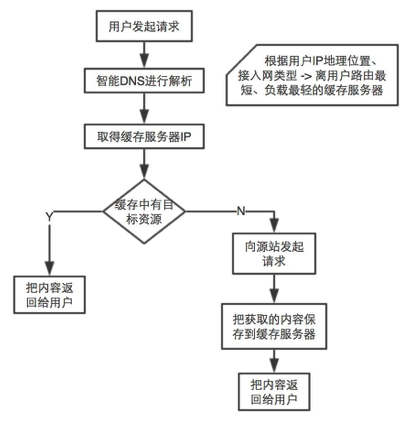
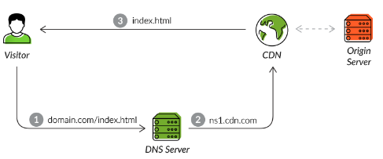

- 其目的是使用户可就近取得所需内容，解决 Internet网络拥挤的状况，提高用户访问网站的响应速度。
- CDN工作流程:

    

- [refer link](https://www.incapsula.com/cdn-guide/what-is-cdn-how-it-works.html)
    
    > For a CDN to work, it needs to be the default inbound gateway for all incoming traffic. To make this happen, you’ll need to modify your root domain DNS configurations (e.g., domain.com) and those of your subdomains (e.g., www.domain.com, img.domain.com).  
    For your root domain, you’ll change its A record to point to one of the CDN’s IP ranges. For each subdomain, modify its CNAME record to point to a CDN-provided subdomain address (e.g., ns1.cdn.com). In both cases, this results in the DNS routing all visitors to your CDN instead of being directed to your original server.