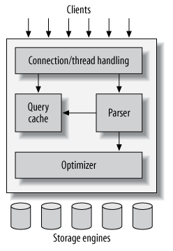
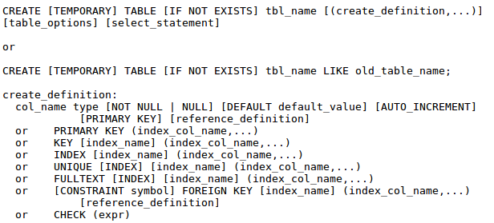
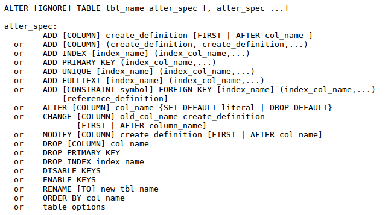
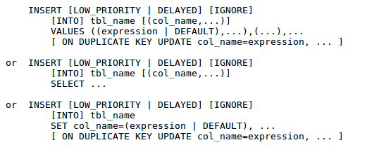
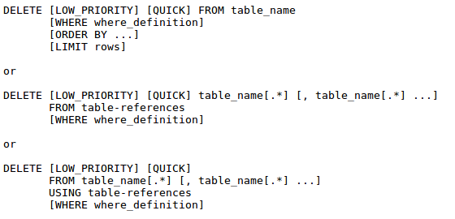
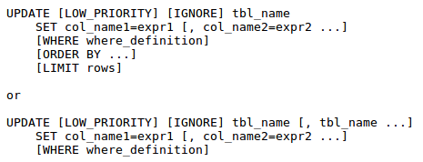
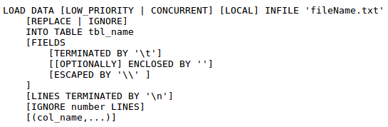
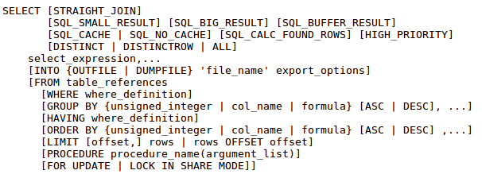

# common notes

- change directory after connecting mysql use following command
    ```sql
    system cd /home/mfyounus    
    ```
 

Notes from <<High Performance MyQSL, 3rd Edition>>

## Logical Architecture



## Concurrency Control

- mysql use read/write lock to prevent corruption.

## LOCK GRANULARITY

- table locks
    the server uses a table-level lock for statements such as ALTER TABLE, regardless of the storage engine. 
- row locks
     Row-level locking is available in the InnoDB and XtraDB storage engines  
     Row locks are implemented in the storage engine, not the server. The server is completely unaware of locks implemented in the storage engines.

## Transactions(事物)

> A transaction is a group of SQL queries that are treated atomically, as a single unit of work. If the database engine can apply the entire group of queries to a database, it does so, but if any of them can’t be done because of a crash or other reason, none of them is applied. It’s all or nothing.

- start a transaction with the `START TRANSACTION` statement and make changes permanent with `COMMIT` or discard with `ROLLBACK`.
    ```sql
    START TRANSACTION;
    SELECT balance FROM checking WHERE customer_id = 10233276;
    UPDATE checking SET balance = balance - 200.00 WHERE customer_id = 10233276;
    UPDATE savings  SET balance = balance + 200.00 WHERE customer_id = 10233276;
    COMMIT;
    ``` 

## Transactions in MySQL

- two storage in MySQL: InnoDB and NDB Cluster.


# MySQL Tutorial

## Normalization

> The normalization process consists of breaking tables into smaller tables that form a better design.

### First Normal Form(1NF)

> each attribute or column value must be atomic. That is, each attribute must contain a single value, not a set of values or another database row. 

### Second Normal Form

> all attributes that are not part of the primary key are fully functionally dependent on the primary key. That is, if the primary key is made up of multiple columns, every other attribute in the table must be dependent on the combination of these columns. (完全依赖于主键[组合])

### Third Normal Form

> Formally, for a schema to be in third normal form (3NF), we must remove all transitive dependencies, and the schema must already be in second normal form.(去除传递性依赖)

1. Normalization is a formal process for improving database design.

2. First normal form (1NF) means atomic column or attribute values.

3. Second normal form (2NF) means that all attributes outside the key must depend on the whole key.

4. Third normal form (3NF) means no transitive dependencies.

5. Boyce-Codd normal form (BCNF) means that all attributes must be functionally determined by a superkey.

## create database and table

```sql
create database dbname;
create table tbname [( table definition )] [engine=table_type];
```



- foreign key: declare by using `references`
    ```sql
    departmentID int not null references department(departmentID)
    ``` 
- declare primary key with multiple column:
    ```sql
    primary key (employeeID, skill)
    ``` 
- The `TEMPORARY` keyword is used to create a table that will be visible only in your current database session, and that will be automatically deleted when your connection is closed. 
- use the `LIKE` old_table_name clause to create a new table with the same schema as old_table_name. 
    ```sql
    CREATE [TEMPORARY] TABLE [IF NOT EXISTS] tbl_name LIKE old_table_name;
    ``` 
- The default is that columns may contain NULLs
- declare a default value for a column using the `DEFAULT` keyword followed by the default value we want.
- can have only one `AUTO_INCREMENT` column per table, and it must be indexed
- some were automatically created for us. Indexes are automatically created for columns that are declared as `PRIMARY KEY`
- UNIQUE can be used to specify that a particular column must contain unique values. UNIQUE columns will also be indexed.
- default table engine: `MyISAM`
- InnoDB is the ACID-compliant storage engine that supports transactions, foreign keys, and row-level locking.
  

## Column and Data Types in MySQL

- three basic types in MySQL:
    - numerical
    - string and text
    - date and time

- Numerical
    ```sql
    salary decimal(10, 2)
    ``` 
    display width of 10 with two digits after the decimal point.

    - may also be followed by the keywords UNSIGNED and/or ZEROFILL. 
    - DECIMAL may also be abbreviated to DEC. 
    - INTEGER can be abbreviated as INT, stored in 4 bytes, giving a range of 232 possible values
    - TINYINT is 1 byte, sunonyms as BIT and BOOL
    - SMALLINT is 2 bytes 
    - MEDIUMINT is 3 bytes
    - BIGINT is 8 bytes 
    - FLOAT, DOUBLE
- String and Text Types
    - CHAR
        - store fixed-length strings, usually followed by a string length
        - If you do not specify a length, you will get a CHAR(1).
        - CHAR and VARCHAR can both be followed by the keyword `BINARY`, meaning that they should be treated as case sensitive when evaluating string comparisons. The default is for strings to be compared in a case insensitive fashion. 
    - VARCHAR
        - stores variable-length strings.
    - TEXT, BLOB and Variations
        - the TEXT types are used for storing longer pieces of text than you can fit in a CHAR or VARCHAR
        - BLOB stands for Binary Large OBject. 
        - These types are the same except that BLOBs are intended to store binary data rather than text.
        - Comparisons on BLOBs are case sensitive, and on TEXTs, they are not.
        - TINYTEXT or TINYBLOB can hold up to 255 (that's 28-1) characters or bytes.
        - TEXT or BLOB can hold up to 65,535 (216-1) characters or bytes (64KB).
        - MEDIUMTEXT or MEDUIMBLOB can hold up to 16,777,215 (224-1) characters or bytes (16MB).
        - LONGTEXT or LONGBLOB can hold up to 4,294,967,295 (232-1) characters or bytes (4GB).
        - ENUM
            declare as: 
            ```sql
            gender enum('m', 'f')
            ``` 
    - SET
        - TODO ??
- Date and Time Types
    - DATE
        - Dates are displayed as YYYY-MM-DD. 
    - TIME
        - displayed as HH:MM:SS.
    - DATETIME
        - The format is YYYY-MM-DD HH:MM:SS. 
    - TIMESTAMP
        - If you do not set this column in a particular row, or set it to NULL, it will store the time that row was inserted or last changed. 
        - When you retrieve a timestamp, it will be displayed in the DATETIME format. 
        - YEAR
  
## Create Indexes

> Any column declared as PRIMARY KEY, KEY, UNIQUE, or INDEX will be indexed. 
```sql
create index name on employee(name);
```
- limit indexes on char and varchar types to index just the first few characters in each field. You can do this by specifying the number of characters you want to be indexed in parentheses after the name of the index column, for example, 
    ```sql
    create index part_name on employee(name(5));
    ``` 
    indexes on text types are not as efficient as indexes on numeric types, and just indexing the first few characters improves performance. 

## Deleting Databases, Tables and Indexes

```sql
drop database employee;
drop table assignment;

DROP [TEMPORARY] TABLE [IF EXISTS] tbl_name [, tbl_name,...]

drop index part_name on employee;
```

## Altering Existing Table

```sql
alter table employee
add index name (name);
```



- DISABLE KEYS clause tells MySQL to stop updating indexes for a MyISAM table only. ENABLE KEYS turns index updating back on. 

## Using INSERT



## Using DELETE



## Using TRUNCATE

```sql
TRUNCATE TABLE employee;
```
delete all the rows from a table. TRUNCATE is not transaction safe.

## Using UPDATE



## Uploading Data with LOAD



- LOCAL, meaning that the data file is on the client machine. If this is not specified, MySQL will look for the infile on the server.
- If you have key clashes while inserting data, REPLACE and IGNORE provide two methods for dealing with this. Specifying REPLACE tells MySQL to replace the old row with the new row, while IGNORE tells MySQL to keep the old row.
- The values in the general form are the defaults—each row on a new line, column values separated by tabs
- The IGNORE number LINES clause tells MySQL to ignore the first number lines in the infile.
- The final clause allows you to specify that you only want to read data into some of the table's columns

# Querying MySQL

- `from t1, t2` is Cartesian product of t1 and t2, also called a full join or cross join.
- `JOIN / CORSS JOIN / INNER JOIN`
    same as connect tables with comma -- "full join"   
    When we perform this type of join, MySQL looks at the tables we are joining and tries to work out the most efficient way to join them together, rather than necessarily joining the tables in the order we have listed.

- LEFT and RIGHT Joins
    ```sql
    select employee.name
    from employee left join assignment
    on employee.employeeID = assignment.employeeID
    where clientID is null;
    ```
    The left join works by taking the left-hand table in the join (in this case, employee) and trying to match it to rows in the right-hand table. These matching rows are placed alongside the left table. For each row in the left table that has no matching rows in the right table, the LEFT JOIN substitutes a row of NULL values. We can find rows from the left table that have no matching row in the right table by searching for a NULL key value. 
    ```shell
    mysql> select * from employee left join assignment on employee.employee_id = assignment.employee_id;

    +-------------+---------------+-----------------------+---------------+-----------+-------------+------------+-------+
    | employee_id | name          | job                   | department_id | client_id | employee_id | workdate   | hours |
    +-------------+---------------+-----------------------+---------------+-----------+-------------+------------+-------+
    |        7513 | Nora Edwards  | Programmer            |           128 |         1 |        7513 | 2003-01-20 |   8.5 |
    |        6651 | Ajay Patel    | Programmer            |           128 |      NULL |        NULL | NULL       |  NULL |
    |        9006 | Candy Burnett | Systems Administrator |           128 |      NULL |        NULL | NULL       |  NULL |
    |        9842 | Ben Smith     | DBA                   |            42 |      NULL |        NULL | NULL       |  NULL |
    +-------------+---------------+-----------------------+---------------+-----------+-------------+------------+-------+
    ```
    the `on` statement is for creating null columns in the resulted joined-rows.

- subqueries

    ```sql
    select e.employeeID, e.name
    from employee e, assignment a
    where e.employeeID = a.employeeID
    and a.hours = (select max(hours) from assignment);
    ```

    `EXIST`:
    ```sql
    select e.name, e.employeeID
    from employee e
    where not exists
            (select *
            from assignment
            where employeeID = e.employeeID);
    ```
    `ALL, IN, SOME, ANY`

- `SELECT` summary
     

# Chapter 8. MySQL Built-in Functions

## Aliases

rename columns or expressions in a SELECT statement, and the new name will be what is shown in the output.
```sql
select name as employeeName
from employee;
```
- as is optional
    ```sql
    select name employeeName
    from employee;

    select e.name
    from employee e;
    ``` 

## WHERE

- cannot use any column aliases in the WHERE clause.

## Removing Duplicates with DISTINCT

## Using the GROUP BY Clause

- consider retrieved rows in groups
- useful when we use it in combination with functions that operate over a group of rows
- sort the group order in which the results are presented by ASC/DESC. The default order is ascending
- A GROUP BY with a HAVING clause is like a SELECT with a WHERE clause. For example: 
    ```SQL
    select count(*), job from employee
    group by job having count(*)=1;
    ```

## Sorting Search Results with ORDER BY

- sort the result rows on one or more columns. The sort can be either ascending
    ```sql
    select * from employee
    order by job asc, name desc;
    ``` 

# LIMIT

- When we pass two parameters to limit, the first parameter is the offset (start point) and the second parameter is the maximum number of rows we would like returned.

    ```sql
    select *
    from employeeSkills
    limit 5, 3;
    ```

## Summary
- SELECT statement:
    ```sql
    SELECT columns
    FROM tables
    [WHERE conditions]
    [ GROUP　BY group 
        [HAVING group_conditions ] 
    ]
    [ORDER BY sort_columns]
    [LIMIT limits];`
    ``` 

## Operators in MySQL

- comparing anything to NULL gives a NULL result
    | operator | meaning |
    | :---- | :---- |
    | = | Equality |
    | != or <> | inequality |
    | < | less than |
    | <= | |
    | > | |
    | >= | |
    | n IN (set) | |
    | <=> | NULL safe equal. Return 1 if compare two NULL |

## Control Flow Functions

- IF
    ```sql
    IF (e1, e2, e3)
    ## If the expression e1 is true, IF returns e2; otherwise, it returns e3.
    ``` 
- CASE
    ```sql
    CASE value
    WHEN [compare-value] THEN result
    [WHEN [compare-value] THEN result ...]
    [ELSE result]
    END
    ``` 
    or 
    ```sql
    CASE
    WHEN [condition] THEN result
    [WHEN [condition] THEN result ...]
    [ELSE result]
    END
    ```

- String Comparison Functions
    
    LIKE: Performs string wildcard matching.

    RLIKE: Performs regular expression matching.

    STRCMP: String comparison, just like the strcmp() function in C.

    MATCH: Performs full-text searching.

- Functions for Use with GROUP BY Clauses
    - avg()
    - count()
    - min()
    - max()
    - std():  standard deviation of the values in column.
    - sum()

## MySQL Table Types

- table types:
    - MyISAM (default)
    - InnoDB
    - BDB
    - MERGE
    - HEAP
    InnoDB and BDB are ransaction safe. The others are not
### MyISAM Tables

- A table automatically becomes dynamic or static depending on the definition of its columns. 
- ables with fixed-length rows will be created as static tables, and tables with variable-length rows will be created as dynamic tables. 
- The char and numeric types all have a fixed size. The size of varchar, text, and blob columns can vary with the size of their contents. A table with only char and numeric columns will be created as a static table, but a table containing any varchar, text, or blob columns will be dynamic. 
- Compressing MyISAM Tables
    - To compress a table, you need to use the command-line program myisampack. 
    - compressed tables become read-only. If you need to alter, update, or insert data in the table, you need to uncompress the entire table
- Full-Text Searching on MyISAM Tables (only in MyISAM)

### InnoDB
- Transactions
- Row-level locking. Others are table-level locking.
- support for foreign keys

### HEAP 
> HEAP tables are extremely fast tables that are stored wholly in memory. They use a hashed indexing scheme that is responsible for their speed. 
> if you have any power issues, your HEAP data is gone forever. They are, however, great for storing temporary tables. 

## Transactions

- a transaction is a sequence of related instructions that must be treated as one indivisible unit. 
- A single update statement in MySQL is always atomic. It cannot be interrupted by another query or half succeed. It will complete or will completely fail on an error. 
- Requesting a lock will implicitly commit any outstanding queries. 

### Locks
```sql
LOCK TABLES t1 write/read;
[queries;]
UNLOCK t1;
```
- Calling LOCK TABLES releases all locks you currently hold
- different transactions can run on the same table at the same time as long as they are all only reading or do not use the same rows if they are writing. 
  
### Transaction Isolation(事物隔离)

- transaction isolation levels
    - serializable
    - repeatable read (default)
    - read committed
    - read uncommitted
    ```sql
    set transaction isolation level serializable;
    ```

- serializable
    - ideal from a purity and robustness angle. 
    - reads and writes on the database should appear to be happening in a sequence

- repeatable read
    - each transaction gets to work in an isolated version of the table where each row remains as it was when the transaction started. Reading a row is guaranteed to be repeatable. 
    - phantom read(幻读)
        - 当前事物可以重复读，就是每次读取的结果集都相同，而不管其他事务有没有提交。
- read committed
- read uncommitted
    - dirty read(脏读)
        - read changes that other transactions have made before the changes have been committed.

# MySQL Index(索引)

> Indexes are used to find rows with specific column values quickly. Without an index, MySQL must begin with the first row and then read through the entire table to find the relevant rows.  
> If the table has an index for the columns in question, MySQL can quickly determine the position to seek to in the middle of the data file without having to look at all the data. This is much faster than reading every row sequentially.

- Most MySQL indexes (PRIMARY KEY, UNIQUE, INDEX, and FULLTEXT) are stored in B-trees
- MySQL uses indexes for these operations:
    - To find the rows matching a WHERE clause quickly.
    - If the table has a multiple-column index, any leftmost prefix of the index can be used by the optimizer to look up rows. For example, if you have a three-column index on (col1, col2, col3), you have indexed search capabilities on (col1), (col1, col2), and (col1, col2, col3). 